# AC01 — Computação Visual: Síntese, Processamento, Visão e Visualização

**Disciplina:** Computação Gráfica — CG_26.2_8001
**Atividade:** Estudo Dirigido 01
**Aluno:** João Pedro Giovanelli Berla

> **Objetivo da atividade:** demonstrar as diferenças e as principais características
> das quatro áreas da Computação Visual — Síntese de Imagens (Computação Gráfica),
> Processamento de Imagens, Visão Computacional e Visualização Computacional —
> selecionando uma aplicação para cada área, apresentando seus aspectos principais e
> **executando** código disponível em repositórios públicos.

Todas as figuras deste relatório foram geradas pelos scripts deste repositório e estão
em [`saidas/`](saidas). Nada aqui é ilustração de terceiros: cada imagem é a saída real
de uma execução.

---

## Sumário

1. [Como executar](#1-como-executar)
2. [O critério que separa as quatro áreas](#2-o-critério-que-separa-as-quatro-áreas)
3. [Área 1 — Síntese de Imagens](#3-área-1--síntese-de-imagens-computação-gráfica)
4. [Área 2 — Processamento de Imagens](#4-área-2--processamento-digital-de-imagens)
5. [Área 3 — Visão Computacional](#5-área-3--visão-computacional)
6. [Área 4 — Visualização Computacional](#6-área-4--visualização-computacional)
7. [Quadro comparativo final](#7-quadro-comparativo-final)
8. [Conclusão](#8-conclusão)
9. [Referências](#9-referências)

---

## 1. Como executar

O ambiente é o mesmo indicado na página da disciplina (Python 3 + VS Code + ambiente
virtual). Não é preciso GPU nem baixar datasets: as imagens de entrada vêm empacotadas
com o `scikit-image` e os classificadores vêm com o `OpenCV`.

```bash
git clone <url-deste-repositorio>
cd <pasta-do-repositorio>

python -m venv .venv
# Windows:  .venv\Scripts\activate
# Linux/macOS:  source .venv/bin/activate

pip install -r requirements.txt

python run_all.py            # executa os 4 experimentos e regrava saidas/
python run_all.py --rapido   # idem, com o ray tracer em qualidade reduzida
```

Cada script também roda isoladamente:

```bash
python 01_sintese_de_imagens/raytracer.py --largura 800 --spp 200
python 02_processamento_de_imagens/processamento.py
python 03_visao_computacional/visao.py
python 04_visualizacao_computacional/visualizacao.py
```

**Tempo total de referência** (1 núcleo de CPU, sem GPU): aproximadamente 1 min 30 s,
sendo ~45 s só do path tracer.

### Estrutura do repositório

```
.
├── 00_comparativo/                 diagramas que organizam as quatro áreas
│   └── diagrama_areas.py
├── 01_sintese_de_imagens/          MODELO 3D  -> IMAGEM
│   ├── raytracer.py                path tracer Monte Carlo (NumPy)
│   ├── rasterizador.py             pipeline OpenGL implementado por software
│   └── convergencia_amostras.py    ruído x número de amostras
├── 02_processamento_de_imagens/    IMAGEM -> IMAGEM
│   └── processamento.py            realce, filtragem, Fourier, bordas, morfologia
├── 03_visao_computacional/         IMAGEM -> DADOS
│   └── visao.py                    Viola-Jones, watershed + medição, ORB + RANSAC
├── 04_visualizacao_computacional/  DADOS  -> IMAGEM
│   └── visualizacao.py             campos escalar/vetorial, volume 3D, colormaps
├── saidas/                         todas as figuras, JSON e CSV gerados
├── requirements.txt
└── run_all.py
```

---

## 2. O critério que separa as quatro áreas

As quatro áreas usam a mesma matemática (álgebra linear, amostragem, convolução) e
frequentemente as mesmas bibliotecas. O que realmente as separa é **a natureza da
entrada e a natureza da saída** de cada processo — o critério clássico de Gomes & Velho.

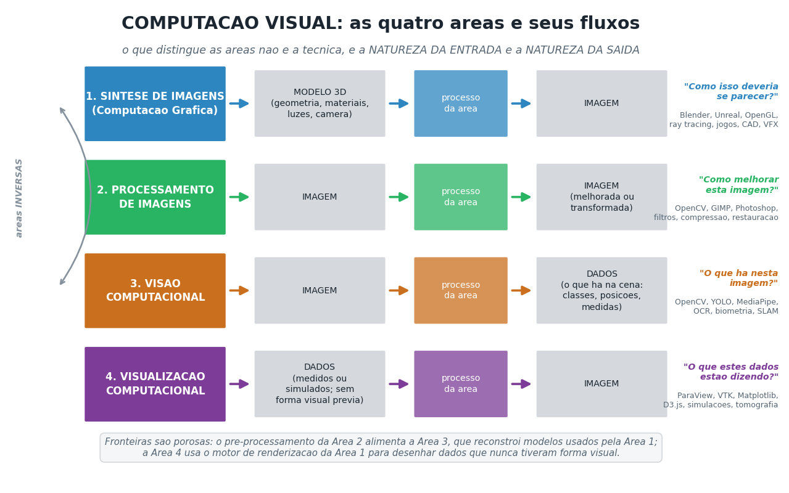

Colocando o mesmo critério em dois eixos, aparece um mapa com um quadrante vazio:

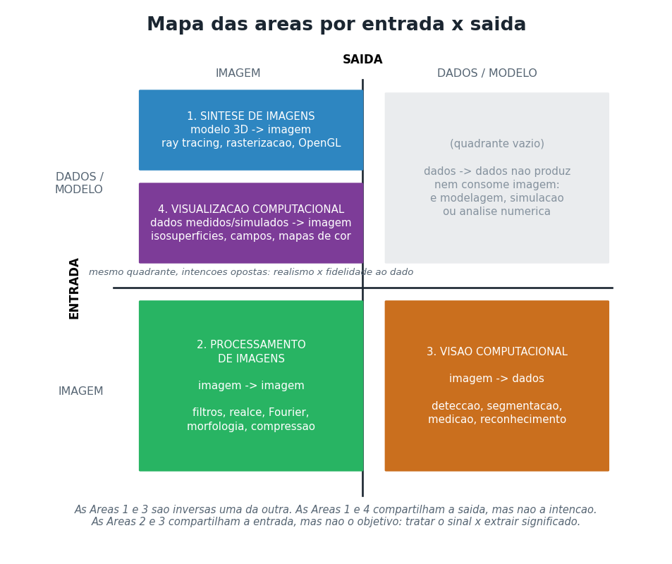

Três consequências que valem a pena registrar antes dos experimentos:

- **Síntese e Visão são áreas inversas.** A síntese parte de um modelo e produz a
  imagem; a visão parte da imagem e tenta recuperar o modelo. A síntese é um problema
  *direto* e bem posto; a visão é um problema *inverso* e mal posto — infinitas cenas
  3D projetam exatamente a mesma imagem 2D, e é por isso que a visão precisa de
  hipóteses, restrições geométricas e aprendizado, enquanto a síntese "só" precisa de
  poder computacional.
- **Síntese e Visualização compartilham a saída, mas não a intenção.** A síntese busca
  realismo ou estética; a visualização busca fidelidade ao dado. Numa cena de cinema é
  aceitável exagerar um brilho para ficar bonito; numa visualização científica, mudar o
  mapa de cor já muda a conclusão de quem olha (ver seção 6.4).
- **Processamento e Visão compartilham a entrada, mas não o objetivo.** O processamento
  trata a imagem como *sinal* a ser melhorado; a visão trata a imagem como *evidência*
  a ser interpretada. Na prática, o processamento costuma ser a etapa inicial da visão —
  no experimento da seção 5.2 a contagem de objetos só funciona depois de uma correção
  de iluminação que é pura Área 2.

---

## 3. Área 1 — Síntese de Imagens (Computação Gráfica)

### 3.1 Aplicação selecionada

**"Ray Tracing in One Weekend"** — Peter Shirley, Trevor David Black e Steve Hollasch.
Repositório público: <https://github.com/RayTracing/raytracing.github.io> (licença CC0).
É a referência didática mais usada no mundo para renderização por traçado de raios, e a
base conceitual de renderizadores de produção como o Cycles (Blender) e o PBRT.

Foi implementado neste repositório um **porte vetorizado em NumPy** do renderizador
descrito nesse material ([`raytracer.py`](01_sintese_de_imagens/raytracer.py)), mais um
**rasterizador por software** ([`rasterizador.py`](01_sintese_de_imagens/rasterizador.py))
que reproduz passo a passo o pipeline que a GPU executa via OpenGL — a API usada na
disciplina com PyOpenGL/GLFW.

### 3.2 Aspectos principais da área

| Aspecto | Como aparece no código |
|---|---|
| Modelagem geométrica | esferas implícitas (equação quadrática) e malhas de triângulos (icosaedro subdividido, cubo) |
| Transformações geométricas | matrizes 4×4 homogêneas: modelo → visão → projeção → viewport |
| Modelo de câmera | pinhole com FOV vertical + lente fina (abertura → profundidade de campo) |
| Visibilidade | traçado de raios (ordem da cena) x Z-buffer (ordem da imagem) |
| Modelos de iluminação | Phong/Blinn-Phong no rasterizador; BRDFs lambertiano, metálico e dielétrico no path tracer |
| Iluminação global | equação de renderização resolvida por Monte Carlo, com até 8 quiques |
| Amostragem e aliasing | supersampling estocástico com *jitter* dentro do pixel |
| Espaço de cor | acúmulo em espaço linear + correção gama na gravação |

### 3.3 Execução e resultados

**a) Path tracer** — 480×270, 128 amostras/pixel, 8 quiques, 16,6 milhões de raios
primários, **43,3 s**:

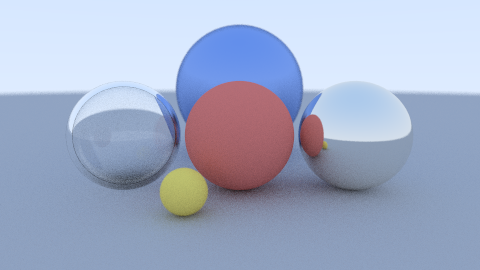

Efeitos que aparecem na imagem **sem terem sido programados explicitamente** — todos
emergem do transporte de luz simulado: sombras suaves (o céu é uma fonte de área),
reflexos mútuos entre as esferas, refração e reflexão total interna no vidro, cor
sangrada do chão nas esferas, e desfoque de profundidade de campo nos objetos fora do
plano focal.

**b) Rasterização** — o outro paradigma da área, resolvendo o mesmo problema
(modelo 3D → imagem) por um caminho oposto: em vez de perguntar "o que este pixel vê?",
pergunta "quais pixels este triângulo cobre?".

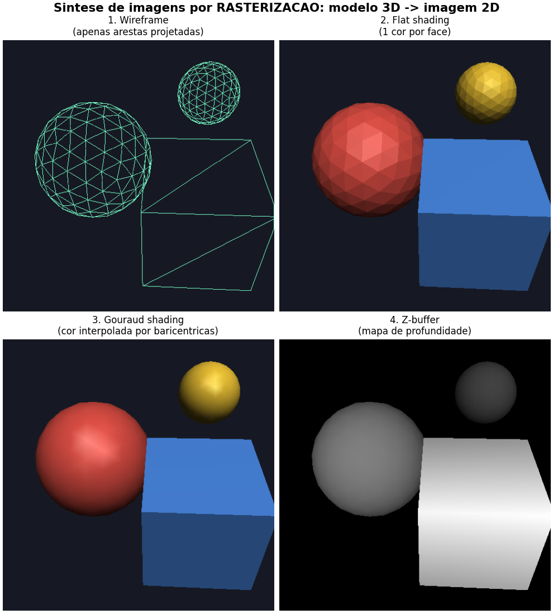

652 triângulos, 460×460. Os quatro painéis são os estágios que a GPU executa: projeção
das arestas (wireframe), preenchimento com uma cor por face (flat), interpolação por
coordenadas baricêntricas (Gouraud) e o Z-buffer que resolve a visibilidade.
Repare que a esfera usa normais suaves (o vértice é a própria normal) enquanto o cubo
usa vértices duplicados por face — é uma decisão de **modelagem**, não de iluminação,
e é o que produz aresta viva num caso e superfície contínua no outro.

**c) Custo do realismo** — o aspecto mais característico da síntese estocástica:

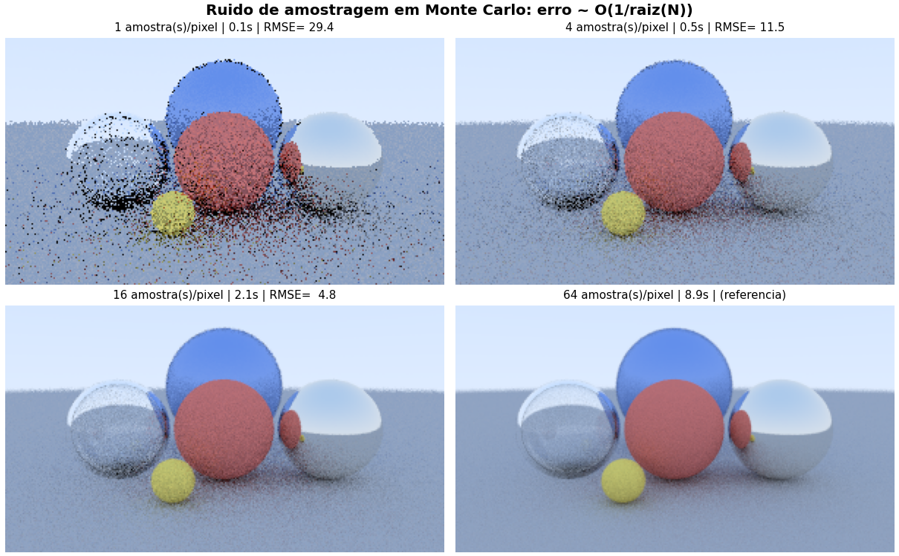

| Amostras/pixel | Tempo | RMSE contra a referência |
|---:|---:|---:|
| 1 | 0,1 s | 29,4 |
| 4 | 0,5 s | 11,5 |
| 16 | 2,1 s | 4,8 |
| 64 | 8,8 s | (referência) |

O erro cai aproximadamente com **O(1/√N)**: quadruplicar as amostras corta o ruído pela
metade e quadruplica o tempo. Esse compromisso não tem equivalente nas outras três
áreas — é consequência direta de a imagem ser produzida por integração numérica.

### 3.4 O que este experimento mostra sobre a área

A entrada não é uma imagem: são números que descrevem geometria, materiais, luzes e
câmera. A imagem é **produzida**, não observada. Por isso a síntese é a única das quatro
áreas em que a qualidade do resultado é limitada por orçamento computacional, e não pela
qualidade do dado de entrada.

---

## 4. Área 2 — Processamento Digital de Imagens

### 4.1 Aplicação selecionada

**OpenCV** (<https://github.com/opencv/opencv>, Apache 2.0) e **scikit-image**
(<https://github.com/scikit-image/scikit-image>, BSD-3) — as duas bibliotecas de código
aberto mais usadas na área. A imagem de entrada é `skimage.data.coins` (303×384, 256
níveis de cinza), que já acompanha a biblioteca.

Script: [`processamento.py`](02_processamento_de_imagens/processamento.py).

### 4.2 Aspectos principais da área

O operador recebe uma imagem e devolve **outra imagem**. Nada é "entendido": o objetivo
é tratar o sinal — realçar, restaurar, comprimir, preparar para uma etapa seguinte.
As categorias clássicas, todas executadas aqui:

1. **Operações pontuais** — `s = T(r)`, cada pixel de saída depende só do de entrada.
2. **Operações de vizinhança** — convolução e estatísticas de ordem.
3. **Operações globais** — transformada de Fourier, equalização de histograma.
4. **Morfologia matemática** — operações baseadas em forma sobre imagens binárias.

### 4.3 Execução e resultados

**a) Operações pontuais** — negativo, subexposição, correção gama e ajuste linear de
contraste:

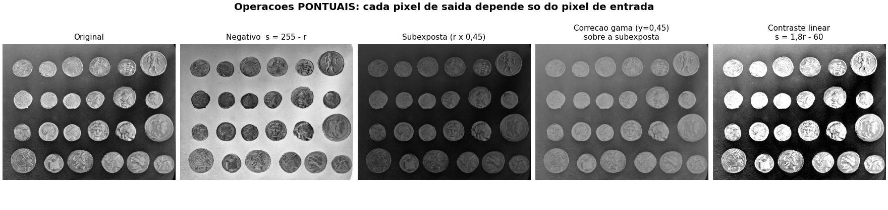

**b) Histograma** — o histograma é a assinatura estatística da imagem e a base do realce:

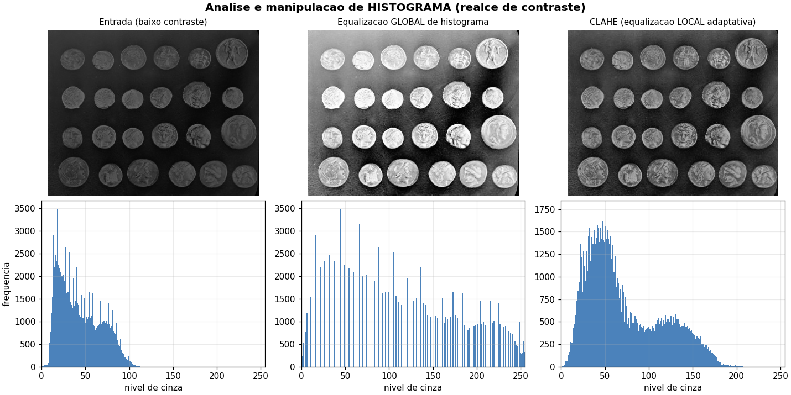

A equalização global espalha os níveis pelo intervalo inteiro, mas amplifica ruído em
regiões homogêneas; o **CLAHE** faz a equalização em blocos com limite de contraste e
preserva melhor a aparência local. A linha de baixo mostra por que: o histograma de
entrada está concentrado em uma faixa estreita, e cada método o redistribui de um jeito.

**c) Filtragem espacial** — e a demonstração de que **o filtro certo depende do ruído**:

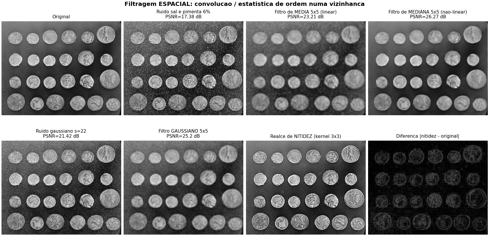

| Situação | PSNR | SSIM |
|---|---:|---:|
| Ruído sal e pimenta (6%) | 17,38 dB | — |
| → filtro de média 5×5 (linear) | 23,21 dB | 0,569 |
| → filtro de mediana 5×5 (não-linear) | **26,27 dB** | **0,773** |
| Ruído gaussiano (σ = 22) | 21,42 dB | — |
| → filtro gaussiano 5×5 | 25,20 dB | 0,692 |

A mediana ganha da média por **3 dB** e por 20 pontos de SSIM no ruído impulsivo. A razão
é estrutural: a média é um operador linear e "dilui" o pixel corrompido entre os vizinhos,
borrando a borda junto; a mediana é uma estatística de ordem, então simplesmente descarta
o valor extremo e preserva o degrau. Métricas objetivas como PSNR e SSIM são o modo padrão
de justificar essa escolha na área.

**d) Domínio da frequência** — a mesma filtragem, vista do outro lado da Transformada de
Fourier:

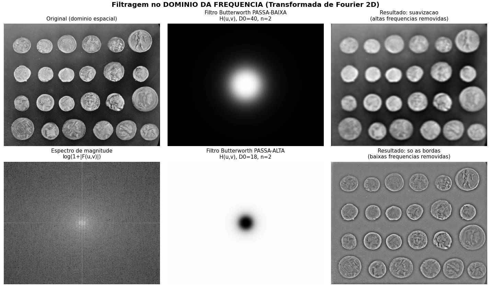

Convolução no espaço equivale a multiplicação na frequência. Um Butterworth passa-baixa
(D₀ = 40) suaviza; um passa-alta (D₀ = 18) deixa só as bordas. O espectro de magnitude
torna explícito o que o filtro espacial faz de forma implícita.

**e) Bordas** — derivadas discretas da função de intensidade:

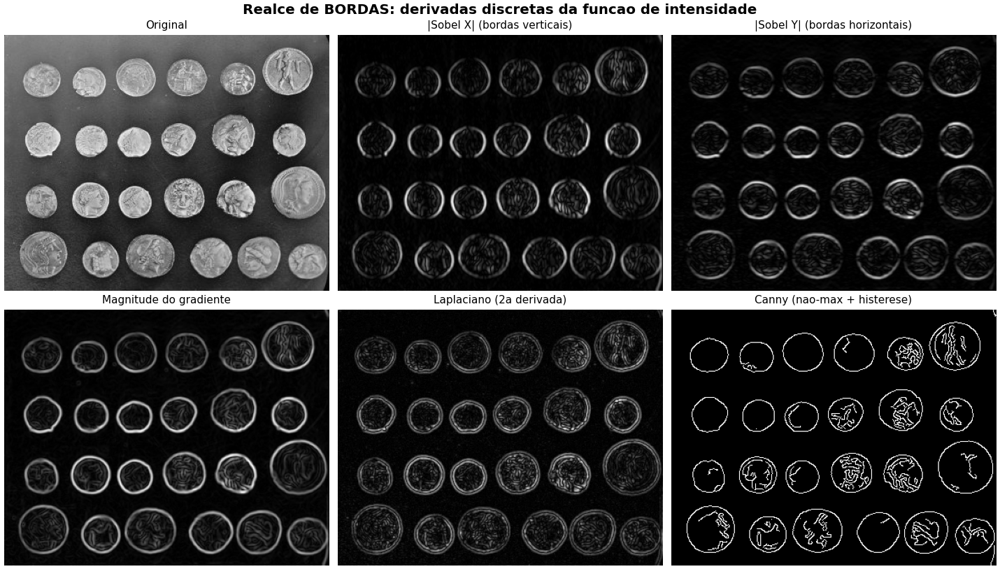

Sobel separa bordas verticais e horizontais (primeira derivada direcional), o Laplaciano
responde à segunda derivada e o Canny acrescenta supressão de não-máximos e histerese —
por isso produz contornos finos e conectados em vez de uma faixa espessa.

**f) Limiarização e morfologia**:

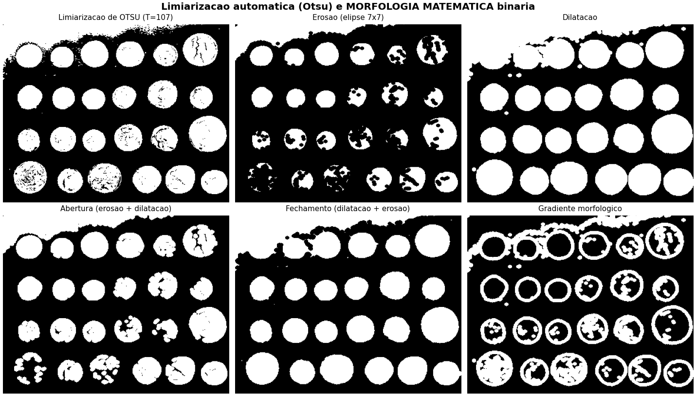

Otsu escolheu automaticamente **T = 107** maximizando a variância entre classes. Em
seguida, erosão, dilatação, abertura, fechamento e gradiente morfológico mostram como
operadores de forma limpam a máscara — o fechamento, em especial, preenche os buracos
internos das moedas e é exatamente o que torna possível a contagem da seção 5.2.

### 4.4 O que este experimento mostra sobre a área

Entrada e saída são do mesmo tipo. Nenhum destes operadores sabe que a imagem contém
moedas; o programa nunca produz a palavra "moeda". O valor entregue é um sinal melhor
— seja para um humano olhar, seja para alimentar a etapa seguinte.

---

## 5. Área 3 — Visão Computacional

### 5.1 Aplicação selecionada

**OpenCV**, usando três recursos distintos do repositório público:
o detector **Viola-Jones** com classificadores Haar pré-treinados que acompanham a
biblioteca, a segmentação por **watershed**, e o detector/descritor **ORB** com
estimação robusta por **RANSAC**.

Script: [`visao.py`](03_visao_computacional/visao.py). As saídas principais **não são
imagens**: são [`deteccoes_faces.json`](saidas/03_visao/deteccoes_faces.json),
[`medicoes_objetos.csv`](saidas/03_visao/medicoes_objetos.csv) e
[`casamento_orb.json`](saidas/03_visao/casamento_orb.json). As figuras existem só para
conferência humana.

### 5.2 Execução e resultados

**a) Detecção de objetos — Viola-Jones (2001)**

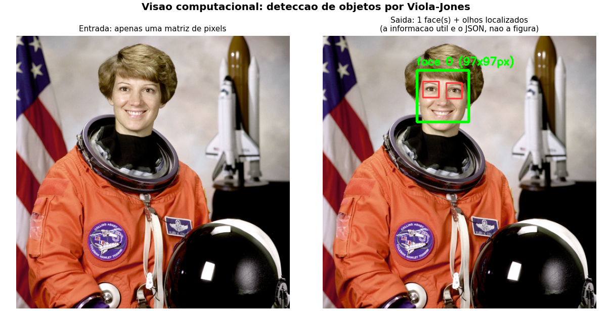

Entrada: `skimage.data.astronaut` (512×512). Saída em JSON:

```json
{
  "id": 0,
  "classe": "face_frontal",
  "caixa": { "x": 176, "y": 65, "largura": 97, "altura": 97 },
  "score_cascata": 6.35,
  "olhos_detectados": [ { "x": 199, "y": 96, ... }, { "x": 232, "y": 95, ... } ]
}
```

Os três aspectos que fizeram desse algoritmo um marco: **características Haar-like**
(diferenças de somas de retângulos, calculadas em tempo constante com a imagem integral),
seleção das mais discriminativas por **AdaBoost**, e organização em **cascata** — os
estágios iniciais descartam rapidamente a esmagadora maioria das janelas que não contêm
face, o que viabilizou detecção em tempo real em 2001. A busca é feita em múltiplas
escalas (`scaleFactor=1.08`) e a detecção de olhos roda *dentro* da região da face,
uma restrição contextual típica da área.

**b) Segmentação e mensuração — contagem automática**

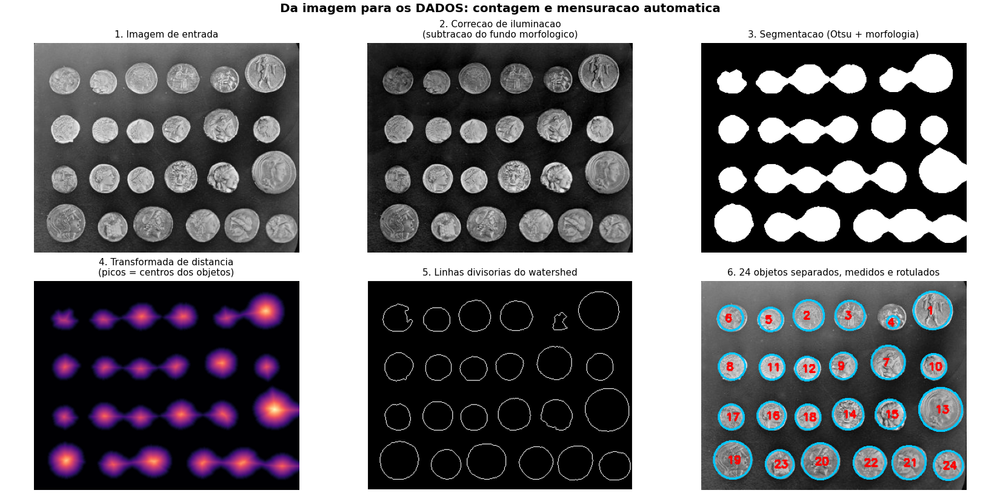

Pipeline completo: correção de iluminação → Otsu → morfologia → transformada de
distância → marcadores → watershed → descritores de região.

| Métrica | Valor |
|---|---:|
| Objetos contados | **24** |
| Gabarito visual | 24 |
| Diâmetro equivalente médio | 42,8 px |
| Faixa de diâmetros | 19,6 – 62,0 px |
| Circularidade média | 0,88 |

Trecho de `medicoes_objetos.csv`:

| id | centroide_x | centroide_y | area_px2 | perimetro_px | diametro_equivalente_px | circularidade | excentricidade |
|---|---|---|---|---|---|---|---|
| 1 | 334,6 | 43,5 | 2463 | 183,9 | 56,0 | 0,915 | 0,313 |
| 2 | 155,2 | 50,8 | 1536 | 145,3 | 44,2 | 0,914 | 0,233 |
| 3 | 215,1 | 51,0 | 1511 | 146,1 | 43,9 | 0,889 | 0,365 |

Dois pontos merecem destaque. Primeiro, **a limiarização sozinha não resolve**: moedas
encostadas viram um único blob. O watershed sobre a transformada de distância trata o
mapa de distâncias como um relevo, usa os picos (centros dos objetos) como marcadores e
inunda a partir deles, separando objetos que se tocam. Segundo, **a Área 2 é
pré-requisito da Área 3**: sem a subtração do fundo estimado por abertura morfológica,
a faixa mais clara do canto superior se funde com as moedas e a contagem cai para 21.
Foi exatamente o que aconteceu na primeira versão deste experimento.

**c) Casamento de características — ORB + RANSAC**

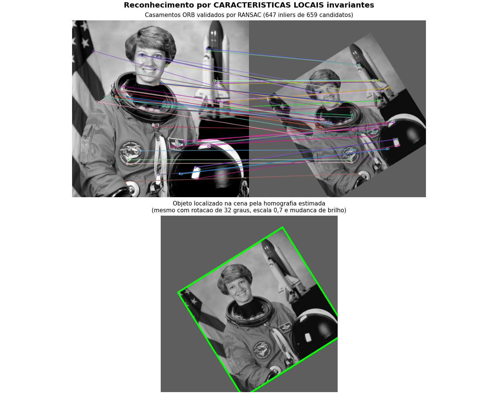

A cena de busca é a mesma imagem **rotacionada 32°, reduzida a 70% e com o brilho
alterado** (α = 0,75, β = +12). Resultado:

| Métrica | Valor |
|---|---:|
| Pontos-chave detectados (imagem 1 / cena) | 1500 / 1500 |
| Casamentos após o teste da razão de Lowe (0,75) | 659 |
| *Inliers* após RANSAC (limiar de 4,0 px) | **647** |
| Taxa de *inliers* | 98,2% |

O contorno verde na segunda imagem é a moldura original projetada pela **homografia
estimada** — o objeto foi localizado geometricamente, não só reconhecido. Três aspectos
centrais da área aparecem aqui: **invariância** (o descritor ORB é robusto a rotação,
escala e mudança de brilho), **ambiguidade** (o teste de Lowe descarta casamentos cuja
melhor e segunda-melhor opção são parecidas demais) e **robustez estatística** (RANSAC
encontra o modelo geométrico consistente com o maior número de correspondências,
ignorando os erros grosseiros). É a mesma base usada em costura de panoramas, realidade
aumentada e SLAM.

### 5.3 O que este experimento mostra sobre a área

A saída é simbólica: coordenadas, contagens, medidas, matrizes de transformação. É o
inverso exato da Área 1 — em vez de renderizar um modelo, o programa tenta **recuperar**
um modelo a partir de pixels. E, por ser um problema inverso e mal posto, cada etapa
precisa de hipóteses explícitas (objetos são aproximadamente circulares, a cena é plana,
o descritor é invariante) que na síntese simplesmente não existem.

---

## 6. Área 4 — Visualização Computacional

### 6.1 Aplicação selecionada

**Matplotlib** (<https://github.com/matplotlib/matplotlib>, BSD) e **scikit-image** para
o *marching cubes*, seguindo o pipeline canônico do **VTK/ParaView**
(<https://github.com/Kitware/VTK>, BSD): `source → filter → mapper → actor`.

Script: [`visualizacao.py`](04_visualizacao_computacional/visualizacao.py). Os dados de
entrada são **gerados por simulação dentro do próprio script** — não são imagens.

### 6.2 Campo escalar: simulação da equação do calor

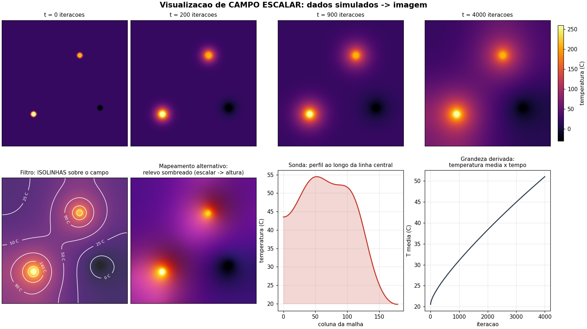

Fonte de dados: `∂T/∂t = α∇²T` resolvida por diferenças finitas explícitas em malha
180×180, 4000 iterações, com duas fontes quentes, um sorvedouro frio e contorno isolado
(Neumann). Temperatura média final: 50,97 °C — série completa em
[`serie_temperatura_media.csv`](saidas/04_visualizacao/serie_temperatura_media.csv).

O painel mostra o **mesmo dado** sob cinco mapeamentos diferentes: evolução temporal em
mapa de cor, isolinhas rotuladas, relevo sombreado (escalar → altura + iluminação —
onde a Área 4 pega emprestado o modelo de iluminação da Área 1), perfil ao longo de uma
linha (sonda) e grandeza derivada ao longo do tempo. Escolher entre eles é a decisão
central da área: cada um responde a uma pergunta diferente sobre a mesma matriz de
números.

### 6.3 Campo vetorial: escoamento potencial

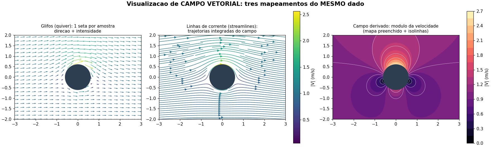

Solução analítica do escoamento ao redor de um cilindro com circulação (escoamento
uniforme + dipolo + vórtice), malha 260×260, |V|máx = 2,57 m/s. Três mapeamentos do
mesmo campo:

- **glifos (quiver)** — uma seta por amostra; mostra direção e módulo, mas satura
  visualmente se a amostragem for densa;
- **linhas de corrente** — integram o campo e revelam a topologia (os pontos de
  estagnação assimétricos, causados pela circulação, só aparecem aqui);
- **campo derivado** — o módulo da velocidade como escalar preenchido, que evidencia a
  aceleração sobre o cilindro.

Nenhum é "o certo": cada um esconde o que o outro mostra.

### 6.4 Volume 3D: cortes e isosuperfícies

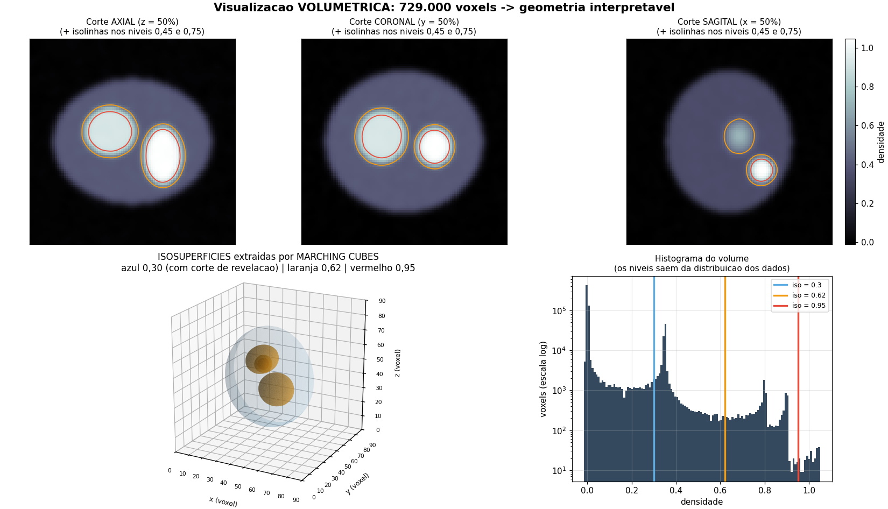

Volume escalar sintético de 90³ = **729.000 voxels** (estilo tomografia: elipsoides
aninhados com ruído suavizado). Duas famílias de técnicas:

- **cortes ortogonais** (axial, coronal, sagital) com isolinhas — a leitura padrão em
  imagem médica;
- **isosuperfícies por *marching cubes***, que convertem o campo escalar em malhas
  triangulares:

| Nível | Vértices | Triângulos |
|---:|---:|---:|
| 0,30 | 16.494 | 32.984 |
| 0,62 | 4.964 | 9.916 |
| 0,95 | 270 | 536 |

Note o que acontece aqui: a Área 4 **produz geometria** e entrega para o renderizador da
Área 1 desenhar. É o ponto de contato mais direto entre as duas. A casca externa recebeu
um corte de revelação (metade dos triângulos foi descartada) para expor o interior — e o
histograma ao lado justifica os níveis escolhidos: eles saem dos picos da distribuição
dos dados, não do gosto de quem visualiza.

### 6.5 Mapas de cor: a decisão mais crítica da área

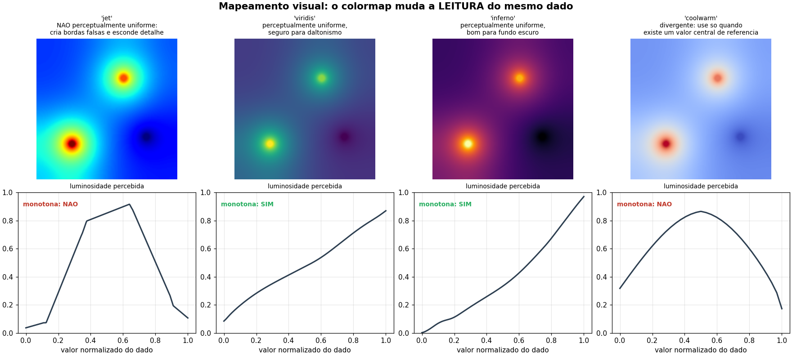

| Colormap | Luminosidade monótona? | Consequência |
|---|---|---|
| `jet` | **não** | cria bordas e faixas que não existem no dado |
| `viridis` | sim | variações uniformes, seguro para daltonismo |
| `inferno` | sim | uniforme, bom para fundo escuro |
| `coolwarm` | **não** | divergente; só use quando existe um valor central de referência |

A curva de luminosidade percebida (linha de baixo) explica por que o `jet` foi abandonado
como padrão: como a luminosidade sobe e desce ao longo da escala, o olho enxerga
transições abruptas onde o dado varia suavemente. Trocar o mapa de cor **muda a
conclusão** de quem olha — e é isso que separa a Área 4 da Área 1: aqui, uma imagem mais
bonita pode ser uma imagem mais errada.

### 6.6 O que este experimento mostra sobre a área

A entrada é um conjunto de dados que **não tinha forma visual nenhuma** — uma matriz de
temperaturas, um campo de velocidades, um volume de densidades. A imagem é criada para
tornar essa estrutura inspecionável. Compartilha as ferramentas da Área 1, mas o critério
de sucesso é oposto: não é o realismo, é a fidelidade e a não-distorção.

---

## 7. Quadro comparativo final

| | **1. Síntese de Imagens** | **2. Processamento** | **3. Visão Computacional** | **4. Visualização** |
|---|---|---|---|---|
| **Entrada** | modelo 3D (geometria, materiais, luzes, câmera) | imagem | imagem | dados medidos ou simulados |
| **Saída** | imagem | imagem | dados / descrição simbólica | imagem |
| **Pergunta** | "como isso deveria se parecer?" | "como melhorar esta imagem?" | "o que há nesta imagem?" | "o que estes dados dizem?" |
| **Tipo de problema** | direto, bem posto | direto, bem posto | **inverso, mal posto** | direto, mas com escolhas subjetivas |
| **Critério de sucesso** | realismo / estética / desempenho | métricas de sinal (PSNR, SSIM) | acurácia contra o gabarito | fidelidade e legibilidade |
| **Aplicação executada** | Ray Tracing in One Weekend (porte NumPy) + rasterizador | OpenCV / scikit-image | OpenCV: Viola-Jones, watershed, ORB+RANSAC | Matplotlib + marching cubes (pipeline VTK) |
| **Resultado obtido** | 16,6 M raios, 43,3 s; RMSE cai com 1/√N | mediana 26,27 dB × média 23,21 dB; Otsu T=107 | 1 face + 2 olhos; **24/24** objetos medidos; 647 inliers (98,2%) | 729.000 voxels → 3 isosuperfícies; 4000 iterações de simulação |
| **Saída em arquivo** | `.png` | `.png` + métricas `.json` | **`.json` e `.csv`** | `.png` + `.csv` da simulação |
| **Bibliotecas típicas** | OpenGL, Vulkan, Blender, PBRT | OpenCV, scikit-image, GIMP | OpenCV, YOLO, MediaPipe | VTK, ParaView, Matplotlib, D3.js |

### Como as áreas se conectam na prática

Os experimentos deixaram três conexões explícitas, e nenhuma delas foi forçada:

1. **Área 2 → Área 3.** A contagem de moedas só chegou a 24/24 depois da correção de
   iluminação por morfologia. Processamento é a etapa de preparação da visão.
2. **Área 4 → Área 1.** O *marching cubes* gera 32.984 triângulos que precisam de um
   renderizador com iluminação e visibilidade — ou seja, da Área 1 — para virarem imagem.
3. **Área 3 → Área 1.** Fotogrametria e reconstrução 3D fecham o ciclo: a visão recupera
   o modelo que a síntese depois renderiza. É o princípio por trás de NeRF e Gaussian
   Splatting.

---

## 8. Conclusão

Executar as quatro áreas sobre problemas concretos deixou claro que a diferença entre
elas não está nas técnicas — convolução, amostragem e álgebra linear aparecem nas quatro
— mas na **direção do fluxo de informação**:

- a **síntese** vai de um modelo para uma imagem e é limitada por orçamento
  computacional (o experimento de convergência mostrou o custo O(1/√N) do realismo);
- o **processamento** vai de imagem para imagem e é avaliado por métricas de sinal (a
  mediana superou a média em 3 dB porque o operador não-linear casa com o modelo de
  ruído);
- a **visão** vai da imagem para os dados e é um problema inverso: precisou de
  pré-processamento, hipóteses geométricas e um estimador robusto para entregar 24/24
  objetos e 98,2% de *inliers*;
- a **visualização** vai dos dados para a imagem e responde por escolhas de
  representação: o mesmo campo escalar contou histórias diferentes conforme o mapeamento
  e o mapa de cor escolhidos.

O quadrante vazio do mapa da seção 2 resume o ponto: a Computação Visual é exatamente o
conjunto de disciplinas em que a imagem é a entrada, a saída, ou as duas coisas.

---

## 9. Referências

**Repositórios públicos utilizados**

- Ray Tracing in One Weekend — <https://github.com/RayTracing/raytracing.github.io> (CC0)
- OpenCV — <https://github.com/opencv/opencv> (Apache 2.0)
- scikit-image — <https://github.com/scikit-image/scikit-image> (BSD-3)
- Matplotlib — <https://github.com/matplotlib/matplotlib> (BSD)
- VTK (pipeline de referência da Área 4) — <https://github.com/Kitware/VTK> (BSD)

**Bibliografia**

- GOMES, J.; VELHO, L. *Computação Gráfica: Imagem*. IMPA. — critério entrada/saída das áreas.
- HUGHES, J. F. et al. *Computer Graphics: Principles and Practice*. 3. ed. Addison-Wesley.
- GONZALEZ, R. C.; WOODS, R. E. *Digital Image Processing*. 4. ed. Pearson.
- SZELISKI, R. *Computer Vision: Algorithms and Applications*. 2. ed. Springer. Disponível em <https://szeliski.org/Book/>.
- SHIRLEY, P.; BLACK, T. D.; HOLLASCH, S. *Ray Tracing in One Weekend*, 2024.
- KAJIYA, J. T. The Rendering Equation. *SIGGRAPH*, 1986.
- VIOLA, P.; JONES, M. Rapid Object Detection using a Boosted Cascade of Simple Features. *CVPR*, 2001.
- LORENSEN, W.; CLINE, H. Marching Cubes: A High Resolution 3D Surface Construction Algorithm. *SIGGRAPH*, 1987.
- RUBLEE, E. et al. ORB: An efficient alternative to SIFT or SURF. *ICCV*, 2011.
- FISCHLER, M.; BOLLES, R. Random Sample Consensus. *Communications of the ACM*, 1981.
- OTSU, N. A Threshold Selection Method from Gray-Level Histograms. *IEEE Trans. SMC*, 1979.
- MUNZNER, T. *Visualization Analysis and Design*. CRC Press.

---

*Todo o código deste repositório é original, escrito para esta atividade, e implementa
algoritmos descritos nas referências acima. As imagens de entrada (`coins`, `astronaut`)
e os classificadores Haar acompanham as bibliotecas citadas.*
