# AC02 — Transformações Geométricas 2D

**Disciplina:** Computação Gráfica — CG_26.2_8001
**Atividade:** Estudo Dirigido 02
**Aluno:** João Pedro Giovanelli Berla

> **Objetivo da atividade:** resolver dez exercícios de transformações geométricas no
> plano — translação, escala (uniforme e não uniforme), rotação, reflexão, cisalhamento
> e composição de transformações — calculando as novas coordenadas e **plotando com
> Matplotlib** cada objeto antes e depois da transformação.

Todas as figuras deste relatório foram geradas pelos scripts desta pasta e estão em
[`saidas/`](saidas). As coordenadas numéricas de todas as respostas também estão em
[`saidas/respostas.json`](saidas/respostas.json), gravado pela mesma execução.

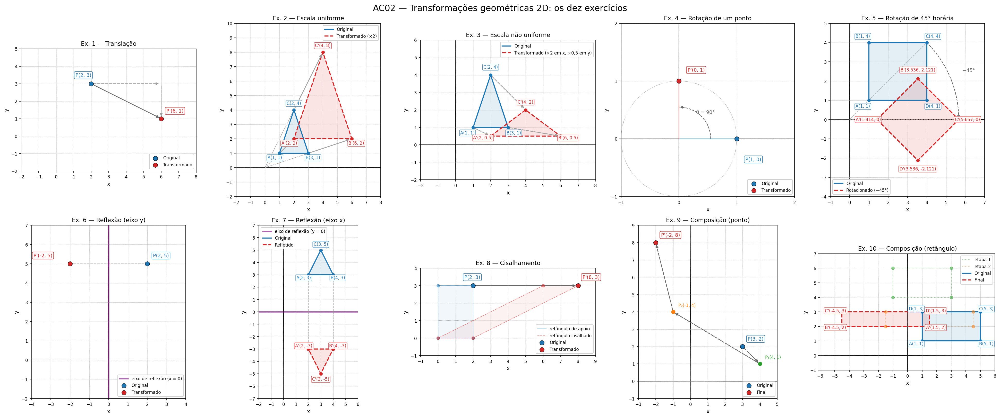

---

## Sumário

1. [Como executar](#1-como-executar)
2. [Fundamentos: coordenadas homogêneas e as matrizes usadas](#2-fundamentos-coordenadas-homogêneas-e-as-matrizes-usadas)
3. [Exercício 1 — Translação simples](#3-exercício-1--translação-simples)
4. [Exercício 2 — Escala uniforme](#4-exercício-2--escala-uniforme)
5. [Exercício 3 — Escala não uniforme](#5-exercício-3--escala-não-uniforme)
6. [Exercício 4 — Rotação em torno da origem](#6-exercício-4--rotação-em-torno-da-origem)
7. [Exercício 5 — Rotação de um polígono](#7-exercício-5--rotação-de-um-polígono)
8. [Exercício 6 — Reflexão simples](#8-exercício-6--reflexão-simples)
9. [Exercício 7 — Reflexão de um triângulo](#9-exercício-7--reflexão-de-um-triângulo)
10. [Exercício 8 — Cisalhamento horizontal](#10-exercício-8--cisalhamento-horizontal)
11. [Exercício 9 — Composição de transformações](#11-exercício-9--composição-de-transformações)
12. [Exercício 10 — Combinação de transformações em uma figura](#12-exercício-10--combinação-de-transformações-em-uma-figura)
13. [Extra: a ordem das transformações importa](#13-extra-a-ordem-das-transformações-importa)
14. [Quadro-resumo das respostas](#14-quadro-resumo-das-respostas)
15. [Referências](#15-referências)

---

## 1. Como executar

Só depende de **NumPy** e **Matplotlib** (o mesmo ambiente Python 3 + VS Code +
ambiente virtual indicado na página da disciplina).

```bash
cd AC2

python -m venv .venv
# Windows:  .venv\Scripts\activate
# Linux/macOS:  source .venv/bin/activate

pip install -r requirements.txt

python run_all.py            # resolve os 10 exercícios e regrava saidas/
python run_all.py --mostrar  # idem, abrindo cada figura numa janela
```

Cada exercício também roda isoladamente — imprime a matriz, as coordenadas e abre a
figura:

```bash
python ex01_translacao.py
python ex05_rotacao_quadrado.py
python ex10_composicao_retangulo.py
```

A execução completa leva cerca de 5 s.

### Estrutura da pasta

```
AC2/
├── transformacoes.py               matrizes 3x3 (T, S, R, F, H), composição e utilitários de plot
├── ex01_translacao.py              Exercício 1
├── ex02_escala_uniforme.py         Exercício 2
├── ex03_escala_nao_uniforme.py     Exercício 3
├── ex04_rotacao_ponto.py           Exercício 4
├── ex05_rotacao_quadrado.py        Exercício 5
├── ex06_reflexao_ponto.py          Exercício 6
├── ex07_reflexao_triangulo.py      Exercício 7
├── ex08_cisalhamento.py            Exercício 8
├── ex09_composicao_ponto.py        Exercício 9
├── ex10_composicao_retangulo.py    Exercício 10
├── run_all.py                      executa tudo, gera painel_geral.png, extra e respostas.json
├── requirements.txt
└── saidas/                         figuras PNG + respostas.json
```

Todos os scripts seguem o mesmo esqueleto sugerido no enunciado: **(1)** definir os
pontos da forma, **(2)** aplicar a transformação, **(3)** plotar o objeto antes e depois.
A diferença é que, em vez de somar/multiplicar arrays diretamente, todas as
transformações passam por **uma única função** — `aplicar(M, pontos)` — que recebe a
matriz homogênea 3×3. Isso deixa os dez exercícios (inclusive os compostos) com o mesmo
código de aplicação, e faz a composição virar uma multiplicação de matrizes.

---

## 2. Fundamentos: coordenadas homogêneas e as matrizes usadas

Em coordenadas cartesianas a translação é uma **soma** ($P' = P + T$) enquanto escala e
rotação são **produtos** por uma matriz 2×2 ($P' = S \cdot P$, $P' = R \cdot P$). Para
tratar todas da mesma forma, cada ponto $(x, y)$ é representado pelo vetor homogêneo
$(x, y, 1)$ e cada transformação por uma matriz 3×3:

$$
P' = M \cdot P
\qquad\Longleftrightarrow\qquad
\begin{bmatrix} x' \\ y' \\ 1 \end{bmatrix} =
M \cdot \begin{bmatrix} x \\ y \\ 1 \end{bmatrix}
$$

As matrizes implementadas em [`transformacoes.py`](transformacoes.py) são exatamente as
dos slides da disciplina:

| Transformação | Função | Matriz $M$ | Efeito |
|---|---|---|---|
| Translação | `translacao(tx, ty)` | $\begin{bmatrix} 1 & 0 & t_x \\ 0 & 1 & t_y \\ 0 & 0 & 1 \end{bmatrix}$ | $x' = x + t_x,\ y' = y + t_y$ |
| Escala | `escala(sx, sy)` | $\begin{bmatrix} s_x & 0 & 0 \\ 0 & s_y & 0 \\ 0 & 0 & 1 \end{bmatrix}$ | $x' = s_x x,\ y' = s_y y$ (uniforme se $s_x = s_y$) |
| Rotação | `rotacao(θ)` | $\begin{bmatrix} \cos\theta & -\sin\theta & 0 \\ \sin\theta & \cos\theta & 0 \\ 0 & 0 & 1 \end{bmatrix}$ | gira $\theta$ em torno da origem; $\theta > 0$ é anti-horário |
| Reflexão no eixo $x$ | `reflexao_eixo_x()` | $\begin{bmatrix} 1 & 0 & 0 \\ 0 & -1 & 0 \\ 0 & 0 & 1 \end{bmatrix}$ | $y' = -y$ |
| Reflexão no eixo $y$ | `reflexao_eixo_y()` | $\begin{bmatrix} -1 & 0 & 0 \\ 0 & 1 & 0 \\ 0 & 0 & 1 \end{bmatrix}$ | $x' = -x$ |
| Cisalhamento horizontal | `cisalhamento(kx)` | $\begin{bmatrix} 1 & k & 0 \\ 0 & 1 & 0 \\ 0 & 0 & 1 \end{bmatrix}$ | $x' = x + k\,y,\ y' = y$ |

**Composição.** Aplicar $M_1$, depois $M_2$, depois $M_3$ a um ponto equivale a aplicar
uma única matriz, obtida multiplicando **da direita para a esquerda** (a primeira
transformação fica encostada no ponto):

$$
P' = M_3 \cdot (M_2 \cdot (M_1 \cdot P)) = (M_3 \cdot M_2 \cdot M_1) \cdot P = M \cdot P
$$

A função `compor(M1, M2, M3)` recebe as matrizes **na ordem em que serão aplicadas** e
devolve $M_3 \cdot M_2 \cdot M_1$. Como o produto de matrizes não é comutativo, trocar a
ordem muda o resultado — a seção 13 mostra isso numericamente.

**Sentido da rotação.** A matriz $R(\theta)$ acima gira no sentido **anti-horário** para
$\theta > 0$. Uma rotação *horária* de 45° é, portanto, $R(-45°)$.

---

## 3. Exercício 1 — Translação simples

> Dado o ponto $P(2, 3)$, aplique a translação com vetor $(4, -2)$.
> **Perguntas:** qual é o novo ponto $P'$? Quais coordenadas foram alteradas?

**Matriz e cálculo**

$$
P' = T(4, -2) \cdot P =
\begin{bmatrix} 1 & 0 & 4 \\ 0 & 1 & -2 \\ 0 & 0 & 1 \end{bmatrix}
\begin{bmatrix} 2 \\ 3 \\ 1 \end{bmatrix} =
\begin{bmatrix} 2 + 4 \\ 3 - 2 \\ 1 \end{bmatrix} =
\begin{bmatrix} 6 \\ 1 \\ 1 \end{bmatrix}
$$

**Resposta:** $P' = (6, 1)$.

**Quais coordenadas foram alteradas?** As duas: $x$ passou de 2 para 6 (somou-se
$t_x = 4$) e $y$ passou de 3 para 1 (somou-se $t_y = -2$). A translação altera toda
coordenada cujo componente do vetor é diferente de zero; como aqui $t_x \neq 0$ e
$t_y \neq 0$, nenhuma coordenada ficou igual. O ponto só se desloca — não há mudança de
tamanho, orientação ou forma.

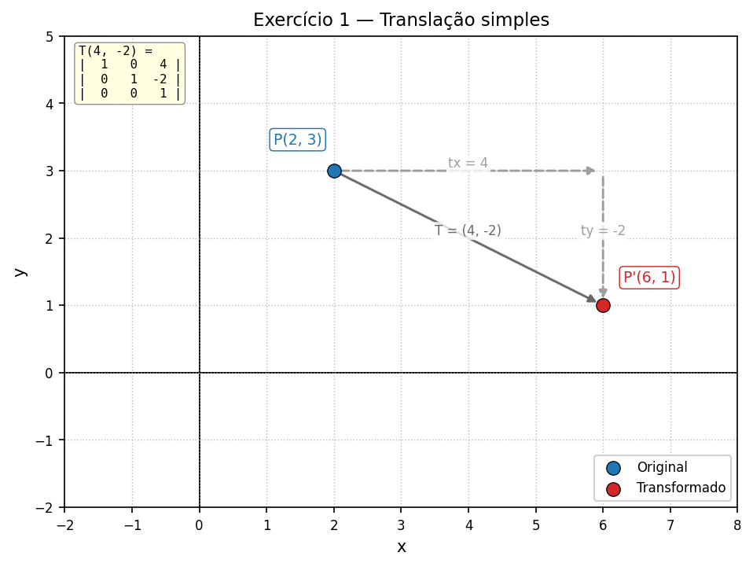

---

## 4. Exercício 2 — Escala uniforme

> Considere um triângulo com vértices $A(1, 1)$, $B(3, 1)$ e $C(2, 4)$. Aplique uma
> escala uniforme de fator 2.
> **Perguntas:** quais são as novas coordenadas dos vértices? O que acontece com o
> tamanho do triângulo?

**Matriz e cálculo**

$$
S(2, 2) = \begin{bmatrix} 2 & 0 & 0 \\ 0 & 2 & 0 \\ 0 & 0 & 1 \end{bmatrix}
\qquad
A' = \begin{bmatrix} 2 \cdot 1 \\ 2 \cdot 1 \end{bmatrix},\quad
B' = \begin{bmatrix} 2 \cdot 3 \\ 2 \cdot 1 \end{bmatrix},\quad
C' = \begin{bmatrix} 2 \cdot 2 \\ 2 \cdot 4 \end{bmatrix}
$$

**Resposta:** $A' = (2, 2)$, $B' = (6, 2)$, $C' = (4, 8)$.

**O que acontece com o tamanho?** Todas as dimensões lineares dobram e a área
quadruplica — o script mede: perímetro de 8.32 para 16.65 (×2) e área de 3 para 12
(×4 $= 2^2$). A forma é preservada (os ângulos não mudam; o triângulo transformado é
*semelhante* ao original). Como a escala é feita em relação à **origem**, o triângulo
também se afasta dela: cada vértice desliza ao longo da reta que o liga à origem
(linhas tracejadas da figura). Um vértice na origem ficaria parado.

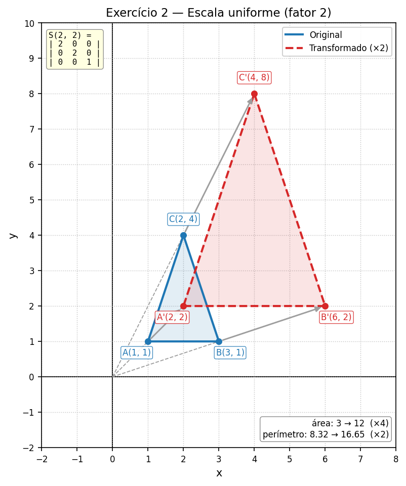

---

## 5. Exercício 3 — Escala não uniforme

> Aplique uma escala não uniforme no triângulo do Exercício 2, com fator 2 no eixo $x$ e
> fator 0.5 no eixo $y$.
> **Pergunta:** quais são as novas coordenadas dos vértices?

**Matriz e cálculo**

$$
S(2,\ 0.5) = \begin{bmatrix} 2 & 0 & 0 \\ 0 & 0.5 & 0 \\ 0 & 0 & 1 \end{bmatrix}
\qquad
A' = \begin{bmatrix} 2 \cdot 1 \\ 0.5 \cdot 1 \end{bmatrix},\quad
B' = \begin{bmatrix} 2 \cdot 3 \\ 0.5 \cdot 1 \end{bmatrix},\quad
C' = \begin{bmatrix} 2 \cdot 2 \\ 0.5 \cdot 4 \end{bmatrix}
$$

**Resposta:** $A' = (2, 0.5)$, $B' = (6, 0.5)$, $C' = (4, 2)$.

Diferente do exercício anterior, a forma **não** é preservada: o triângulo fica duas
vezes mais largo e duas vezes mais baixo (escala *diferencial*, no vocabulário dos
slides). Um detalhe que o script confirma: a área fica igual a 3, porque o fator de
área é $s_x \cdot s_y = 2 \cdot 0.5 = 1$ — o determinante da matriz.

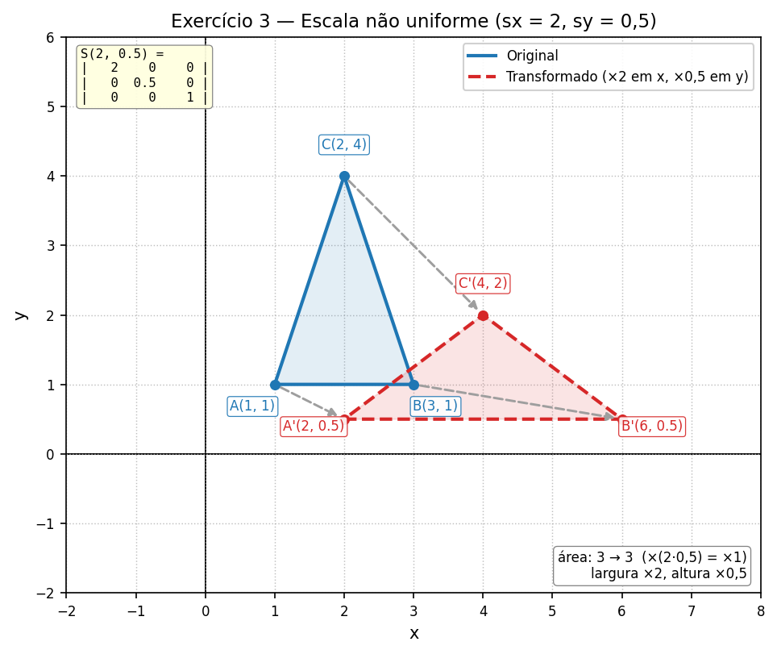

---

## 6. Exercício 4 — Rotação em torno da origem

> Rotacione o ponto $P(1, 0)$ em 90° no sentido anti-horário em torno da origem.
> **Pergunta:** qual é a nova posição do ponto $P'$ após a rotação?

**Matriz e cálculo** — com $\cos 90° = 0$ e $\sin 90° = 1$:

$$
P' = R(90°) \cdot P =
\begin{bmatrix} 0 & -1 & 0 \\ 1 & 0 & 0 \\ 0 & 0 & 1 \end{bmatrix}
\begin{bmatrix} 1 \\ 0 \\ 1 \end{bmatrix} =
\begin{bmatrix} 0 \cdot 1 - 1 \cdot 0 \\ 1 \cdot 1 + 0 \cdot 0 \\ 1 \end{bmatrix} =
\begin{bmatrix} 0 \\ 1 \\ 1 \end{bmatrix}
$$

**Resposta:** $P' = (0, 1)$.

O ponto estava sobre o eixo $x$ positivo, a uma distância 1 da origem; um quarto de
volta no sentido anti-horário o leva ao eixo $y$ positivo, mantendo a distância (a
rotação preserva o raio — o círculo pontilhado da figura). Em ponto flutuante o
resultado sai como $(6 \times 10^{-17},\ 1)$; o script zera resíduos abaixo de
$10^{-12}$ antes de imprimir.

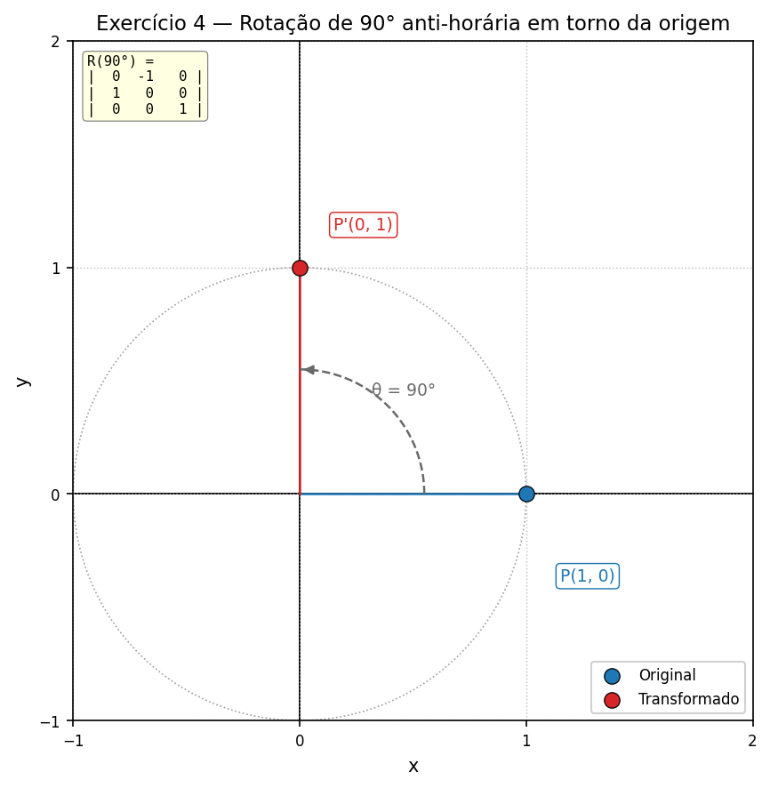

---

## 7. Exercício 5 — Rotação de um polígono

> Um quadrado tem vértices $A(1, 1)$, $B(1, 4)$, $C(4, 4)$, $D(4, 1)$. Aplique uma rotação
> de 45° no sentido horário.
> **Pergunta:** quais são as novas coordenadas dos vértices?

Sentido horário ⇒ $\theta = -45°$, com $\cos(-45°) = \tfrac{\sqrt{2}}{2}$ e
$\sin(-45°) = -\tfrac{\sqrt{2}}{2}$:

$$
R(-45°) =
\begin{bmatrix} \tfrac{\sqrt{2}}{2} & \tfrac{\sqrt{2}}{2} & 0 \\ -\tfrac{\sqrt{2}}{2} & \tfrac{\sqrt{2}}{2} & 0 \\ 0 & 0 & 1 \end{bmatrix}
\approx
\begin{bmatrix} 0.707 & 0.707 & 0 \\ -0.707 & 0.707 & 0 \\ 0 & 0 & 1 \end{bmatrix}
\qquad\Rightarrow\qquad
x' = \tfrac{\sqrt{2}}{2}(x + y),\quad y' = \tfrac{\sqrt{2}}{2}(y - x)
$$

O enunciado não fixa o ponto de referência; como no Exercício 4, e como na matriz
$R(\theta)$ da aula, a rotação é feita **em torno da origem**.

**Resposta (em torno da origem):**

| Vértice | Cálculo | Exato | Aproximado |
|---|---|---|---|
| $A(1, 1)$ | $\tfrac{\sqrt2}{2}(2),\ \tfrac{\sqrt2}{2}(0)$ | $(\sqrt{2},\ 0)$ | $(1.414,\ 0)$ |
| $B(1, 4)$ | $\tfrac{\sqrt2}{2}(5),\ \tfrac{\sqrt2}{2}(3)$ | $(\tfrac{5\sqrt{2}}{2},\ \tfrac{3\sqrt{2}}{2})$ | $(3.536,\ 2.121)$ |
| $C(4, 4)$ | $\tfrac{\sqrt2}{2}(8),\ \tfrac{\sqrt2}{2}(0)$ | $(4\sqrt{2},\ 0)$ | $(5.657,\ 0)$ |
| $D(4, 1)$ | $\tfrac{\sqrt2}{2}(5),\ \tfrac{\sqrt2}{2}(-3)$ | $(\tfrac{5\sqrt{2}}{2},\ -\tfrac{3\sqrt{2}}{2})$ | $(3.536,\ -2.121)$ |

A diagonal $AC$ do quadrado estava a 45° do eixo $x$; girada 45° no sentido horário,
ela cai exatamente **sobre** o eixo $x$ — por isso $A'$ e $C'$ têm $y = 0$. O quadrado
continua um quadrado de lado 3 (a rotação preserva distâncias e ângulos), mas agora
aparece "em pé", como um losango, e parte dele fica abaixo do eixo $x$.

**Complemento — rotação em torno do próprio centro.** Se a intenção fosse girar o
quadrado "no lugar", o ponto de referência seria o centro $c = (2.5,\ 2.5)$ e a matriz
seria a composição dos slides ("rotação com ponto de referência"):
$M = T(c) \cdot R(-45°) \cdot T(-c)$. Nesse caso os vértices vão para
$A' = (0.379,\ 2.5)$, $B' = (2.5,\ 4.621)$, $C' = (4.621,\ 2.5)$, $D' = (2.5,\ 0.379)$
— o mesmo losango, mas centrado onde o quadrado já estava. O painel direito da figura
mostra essa variante.

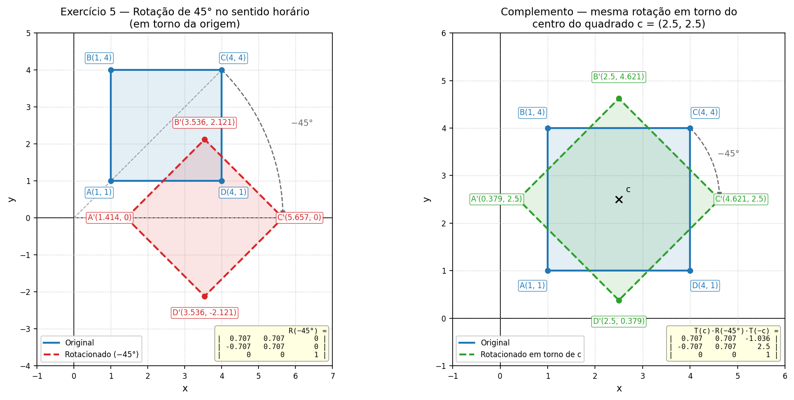

---

## 8. Exercício 6 — Reflexão simples

> Dado o ponto $P(2, 5)$, aplique uma reflexão em relação ao eixo $y$.
> **Pergunta:** qual é a nova posição do ponto $P'$?

Refletir em relação ao eixo $y$ (a reta $x = 0$) troca o sinal de $x$ e mantém $y$:

$$
P' = F_y \cdot P =
\begin{bmatrix} -1 & 0 & 0 \\ 0 & 1 & 0 \\ 0 & 0 & 1 \end{bmatrix}
\begin{bmatrix} 2 \\ 5 \\ 1 \end{bmatrix} =
\begin{bmatrix} -2 \\ 5 \\ 1 \end{bmatrix}
$$

**Resposta:** $P' = (-2, 5)$.

$P$ e $P'$ ficam à mesma distância ($d = 2$) do eixo de reflexão, em lados opostos, e
o segmento $PP'$ é perpendicular ao eixo. A reflexão é o caso particular de escala com
fator $-1$ em um dos eixos.

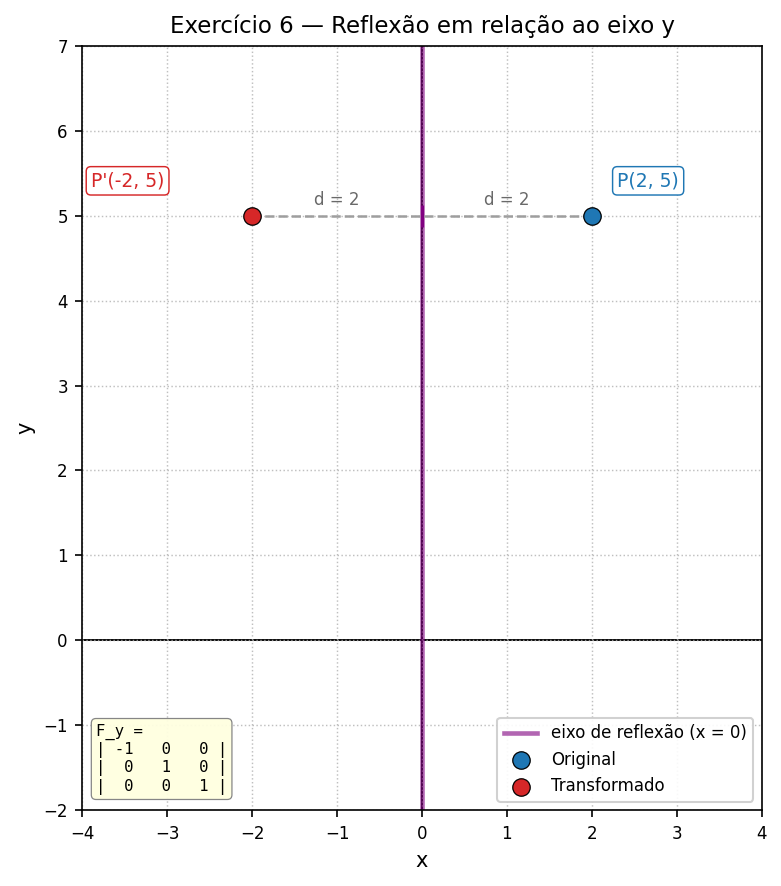

---

## 9. Exercício 7 — Reflexão de um triângulo

> Considere um triângulo com vértices $A(2, 3)$, $B(4, 3)$ e $C(3, 5)$. Aplique uma
> reflexão em relação ao eixo $x$.
> **Pergunta:** quais são as novas coordenadas dos vértices após a transformação?

Refletir em relação ao eixo $x$ (a reta $y = 0$) troca o sinal de $y$ e mantém $x$:

$$
F_x = \begin{bmatrix} 1 & 0 & 0 \\ 0 & -1 & 0 \\ 0 & 0 & 1 \end{bmatrix}
\qquad
A' = (2,\ -3),\quad B' = (4,\ -3),\quad C' = (3,\ -5)
$$

**Resposta:** $A' = (2, -3)$, $B' = (4, -3)$, $C' = (3, -5)$.

O triângulo aparece "de cabeça para baixo" abaixo do eixo $x$, com o mesmo tamanho e a
mesma forma. Um detalhe que só a reflexão tem entre as transformações deste trabalho:
ela **inverte a orientação** do polígono — percorrendo $A \to B \to C$ o triângulo
original é anti-horário, e $A' \to B' \to C'$ é horário. Isso aparece no determinante
da matriz, que vale $-1$.

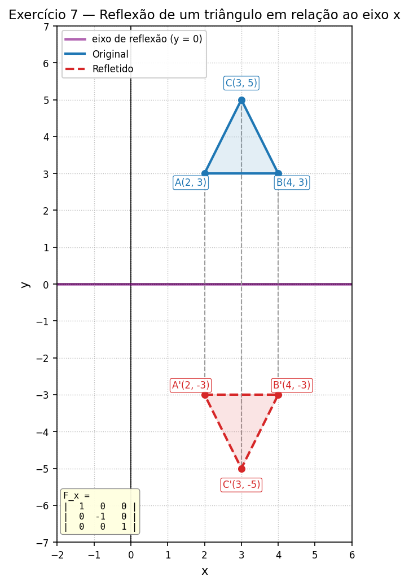

---

## 10. Exercício 8 — Cisalhamento horizontal

> Dado o ponto $P(2, 3)$, aplique um cisalhamento horizontal com $k = 2$.
> **Pergunta:** qual é a nova posição do ponto $P'$?

No cisalhamento horizontal cada ponto é empurrado em $x$ de uma quantidade
proporcional à sua altura $y$:

$$
P' = H(2) \cdot P =
\begin{bmatrix} 1 & 2 & 0 \\ 0 & 1 & 0 \\ 0 & 0 & 1 \end{bmatrix}
\begin{bmatrix} 2 \\ 3 \\ 1 \end{bmatrix} =
\begin{bmatrix} 2 + 2 \cdot 3 \\ 3 \\ 1 \end{bmatrix} =
\begin{bmatrix} 8 \\ 3 \\ 1 \end{bmatrix}
$$

**Resposta:** $P' = (8, 3)$.

O deslocamento foi $k \cdot y = 2 \cdot 3 = 6$ unidades em $x$; $y$ não muda. Para
tornar o efeito visível, a figura também cisalha o retângulo $[0, 2] \times [0, 3]$
que tem $P$ como canto: a base (onde $y = 0$) fica parada e o topo desliza 6 unidades,
transformando o retângulo em um paralelogramo de mesma área — o determinante de $H$ é 1.

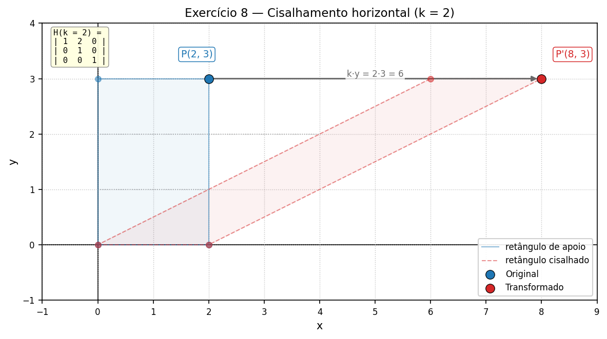

---

## 11. Exercício 9 — Composição de transformações

> Dado o ponto $P(3, 2)$, aplique as seguintes transformações consecutivas:
> 1. uma translação com vetor $(1, -1)$;
> 2. uma rotação de 90° no sentido anti-horário;
> 3. uma escala uniforme com fator 2.
>
> **Pergunta:** qual é a nova posição do ponto $P'$ após todas as transformações?

**Passo a passo:**

| Passo | Matriz | Resultado |
|---|---|---|
| 0. ponto original | — | $P = (3, 2)$ |
| 1. $T(1, -1)$ | $\begin{bmatrix} 1 & 0 & 1 \\ 0 & 1 & -1 \\ 0 & 0 & 1 \end{bmatrix}$ | $P_1 = (3 + 1,\ 2 - 1) = (4, 1)$ |
| 2. $R(90°)$ | $\begin{bmatrix} 0 & -1 & 0 \\ 1 & 0 & 0 \\ 0 & 0 & 1 \end{bmatrix}$ | $P_2 = (-1,\ 4)$ |
| 3. $S(2)$ | $\begin{bmatrix} 2 & 0 & 0 \\ 0 & 2 & 0 \\ 0 & 0 & 1 \end{bmatrix}$ | $P' = (-2,\ 8)$ |

**Matriz composta** — a primeira transformação aplicada fica mais à direita:

$$
M = S(2) \cdot R(90°) \cdot T(1, -1) =
\begin{bmatrix} 0 & -2 & 2 \\ 2 & 0 & 2 \\ 0 & 0 & 1 \end{bmatrix}
\qquad
M \cdot \begin{bmatrix} 3 \\ 2 \\ 1 \end{bmatrix} =
\begin{bmatrix} 0 - 4 + 2 \\ 6 + 0 + 2 \\ 1 \end{bmatrix} =
\begin{bmatrix} -2 \\ 8 \\ 1 \end{bmatrix}
$$

**Resposta:** $P' = (-2, 8)$.

O script faz as duas contas — passo a passo e com a matriz composta — e verifica com
`assert` que coincidem. A figura mostra cada passo em um painel e, no último, a
trajetória completa $P \to P_1 \to P_2 \to P'$.

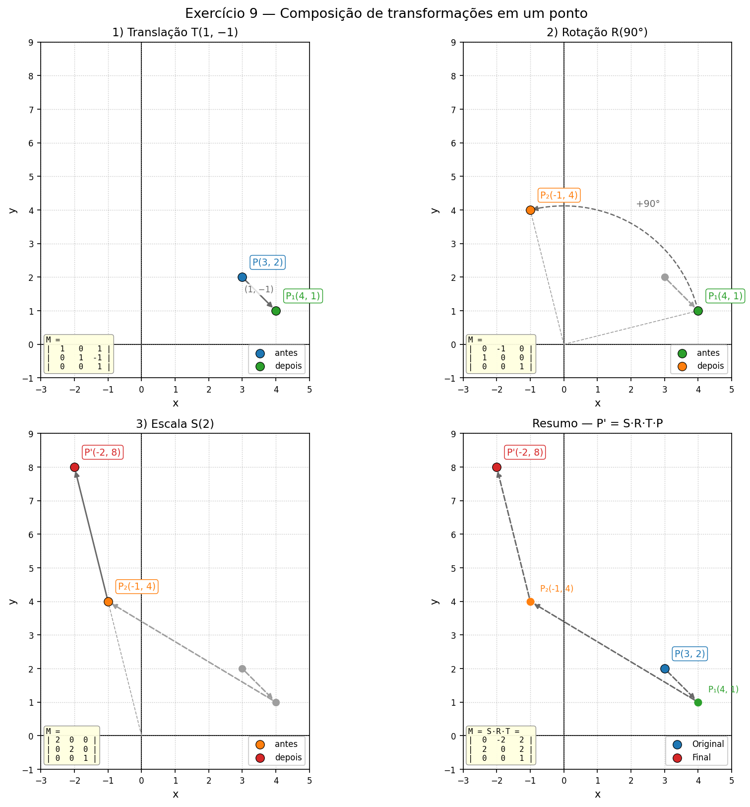

---

## 12. Exercício 10 — Combinação de transformações em uma figura

> Dado um retângulo com vértices $A(1, 1)$, $B(5, 1)$, $C(5, 3)$, $D(1, 3)$, aplique as
> seguintes transformações em sequência:
> 1. translação com vetor $(-2, 3)$;
> 2. escala não uniforme com fatores 1.5 no eixo $x$ e 0.5 no eixo $y$;
> 3. reflexão em relação ao eixo $y$.
>
> **Pergunta:** quais são as novas coordenadas dos vértices após as três transformações?

**Passo a passo:**

| Passo | $A$ | $B$ | $C$ | $D$ |
|---|---|---|---|---|
| 0. original | $(1, 1)$ | $(5, 1)$ | $(5, 3)$ | $(1, 3)$ |
| 1. $T(-2, 3)$ | $(-1, 4)$ | $(3, 4)$ | $(3, 6)$ | $(-1, 6)$ |
| 2. $S(1.5,\ 0.5)$ | $(-1.5, 2)$ | $(4.5, 2)$ | $(4.5, 3)$ | $(-1.5, 3)$ |
| 3. $F_y$ | $(1.5, 2)$ | $(-4.5, 2)$ | $(-4.5, 3)$ | $(1.5, 3)$ |

**Matriz composta:**

$$
M = F_y \cdot S(1.5,\ 0.5) \cdot T(-2, 3) =
\begin{bmatrix} -1 & 0 & 0 \\ 0 & 1 & 0 \\ 0 & 0 & 1 \end{bmatrix}
\begin{bmatrix} 1.5 & 0 & 0 \\ 0 & 0.5 & 0 \\ 0 & 0 & 1 \end{bmatrix}
\begin{bmatrix} 1 & 0 & -2 \\ 0 & 1 & 3 \\ 0 & 0 & 1 \end{bmatrix} =
\begin{bmatrix} -1.5 & 0 & 3 \\ 0 & 0.5 & 1.5 \\ 0 & 0 & 1 \end{bmatrix}
$$

Ou seja, $x' = -1.5x + 3$ e $y' = 0.5y + 1.5$. Conferindo com $A(1, 1)$:
$x' = -1.5 + 3 = 1.5$, $y' = 0.5 + 1.5 = 2$ ✓.

**Resposta:** $A' = (1.5, 2)$, $B' = (-4.5, 2)$, $C' = (-4.5, 3)$, $D' = (1.5, 3)$.

O retângulo de $4 \times 2$ virou um retângulo de $6 \times 1$ (largura ×1.5, altura
×0.5), foi deslocado e, por fim, espelhado para o outro lado do eixo $y$ — repare que a
reflexão inverteu a ordem dos vértices ($A'$ agora está à **direita** de $B'$).

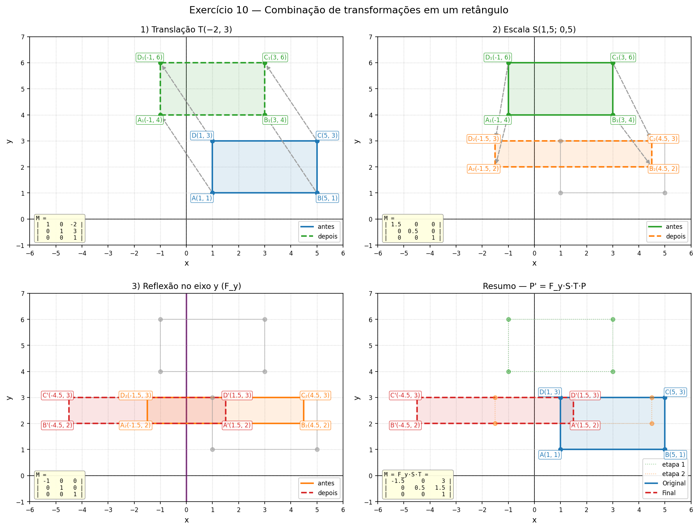

---

## 13. Extra: a ordem das transformações importa

Os slides destacam que $M_2 \cdot M_1 \neq M_1 \cdot M_2$ em geral. Para ver isso com
números, `run_all.py` repete o Exercício 9 na ordem inversa (escala → rotação →
translação):

| Ordem | Matriz composta | $P'$ |
|---|---|---|
| $T \to R \to S$ (enunciado) | $M = S \cdot R \cdot T = \begin{bmatrix} 0 & -2 & 2 \\ 2 & 0 & 2 \\ 0 & 0 & 1 \end{bmatrix}$ | $(-2, 8)$ |
| $S \to R \to T$ (invertida) | $M = T \cdot R \cdot S = \begin{bmatrix} 0 & -2 & 1 \\ 2 & 0 & -1 \\ 0 & 0 & 1 \end{bmatrix}$ | $(-3, 5)$ |

As mesmas três transformações produzem pontos diferentes: a parte linear (rotação +
escala) é a mesma nas duas matrizes, mas a coluna de translação muda, porque na primeira
ordem a translação $(1, -1)$ também é rotacionada e dobrada pelas transformações que vêm
depois dela, e na segunda ela é aplicada por último, sem alteração.

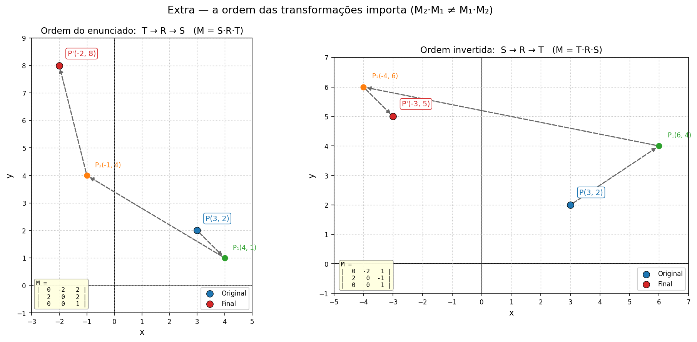

---

## 14. Quadro-resumo das respostas

| Ex. | Transformação | Entrada | Resposta |
|---|---|---|---|
| 1 | $T(4, -2)$ | $P(2, 3)$ | $P' = (6, 1)$ — as duas coordenadas mudaram |
| 2 | $S(2, 2)$ | $A(1,1),\ B(3,1),\ C(2,4)$ | $A'(2,2),\ B'(6,2),\ C'(4,8)$ — lados ×2, área ×4 |
| 3 | $S(2,\ 0.5)$ | idem | $A'(2,\ 0.5),\ B'(6,\ 0.5),\ C'(4,\ 2)$ |
| 4 | $R(90°)$ | $P(1, 0)$ | $P' = (0, 1)$ |
| 5 | $R(-45°)$ | $A(1,1),\ B(1,4),\ C(4,4),\ D(4,1)$ | $A'(1.414,\ 0),\ B'(3.536,\ 2.121),\ C'(5.657,\ 0),\ D'(3.536,\ -2.121)$ |
| 6 | $F_y$ | $P(2, 5)$ | $P' = (-2, 5)$ |
| 7 | $F_x$ | $A(2,3),\ B(4,3),\ C(3,5)$ | $A'(2,-3),\ B'(4,-3),\ C'(3,-5)$ |
| 8 | $H(k = 2)$ | $P(2, 3)$ | $P' = (8, 3)$ |
| 9 | $S(2) \cdot R(90°) \cdot T(1,-1)$ | $P(3, 2)$ | $P' = (-2, 8)$ |
| 10 | $F_y \cdot S(1.5, 0.5) \cdot T(-2, 3)$ | $A(1,1),\ B(5,1),\ C(5,3),\ D(1,3)$ | $A'(1.5,2),\ B'(-4.5,2),\ C'(-4.5,3),\ D'(1.5,3)$ |

---

## 15. Referências

- Slides da disciplina: *Transformações Geométricas 2D/3D* (CG_26.2_8001, aulas 03 e 04) —
  notação $P' = M \cdot P$, coordenadas homogêneas, matrizes de reflexão e cisalhamento,
  rotação/escala com ponto de referência.
- HUGHES, J. F. et al. *Computer Graphics: Principles and Practice*. 3. ed.
  Addison-Wesley, 2014 — cap. 10 (transformações 2D) e cap. 11 (transformações 3D).
- MARSCHNER, S.; SHIRLEY, P. *Fundamentals of Computer Graphics*. 5. ed. CRC Press,
  2021 — cap. 6 (Transformation Matrices).
- Matplotlib — <https://matplotlib.org/stable/> (funções `plot`, `scatter`, `annotate`).
- NumPy — <https://numpy.org/doc/stable/> (operador `@` para produto de matrizes).

---

*Todo o código desta pasta é original e foi escrito para esta atividade. As figuras são
saídas reais de `run_all.py`.*
