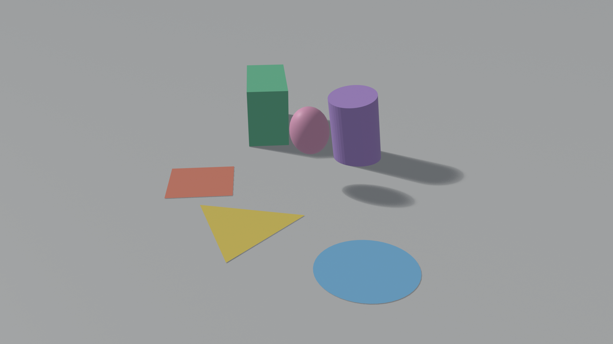
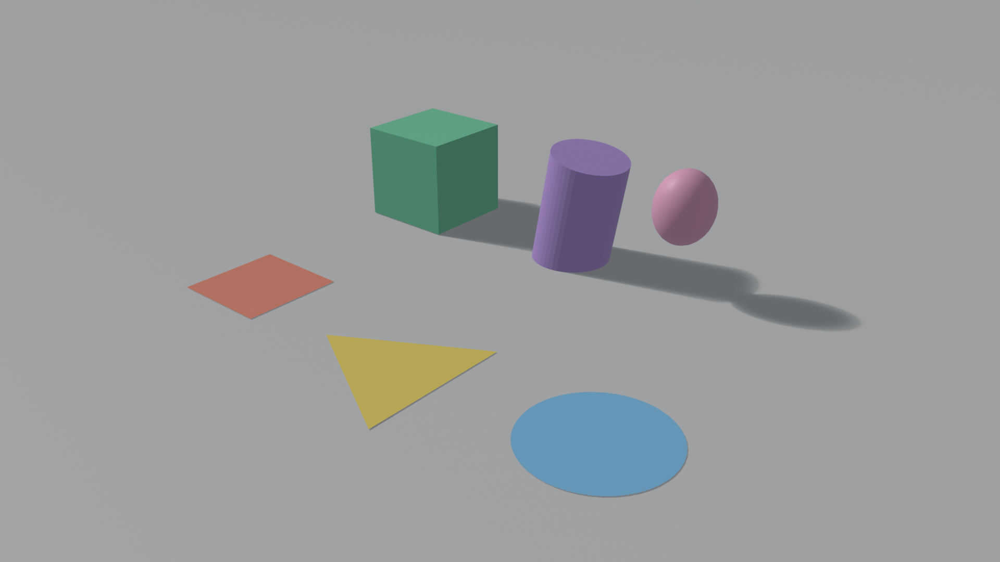
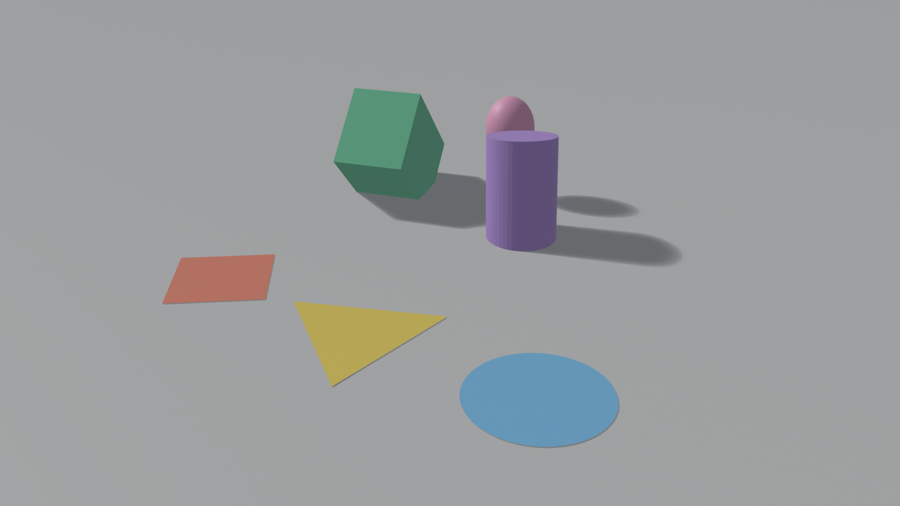

# AC03 — Transformações Geométricas 2D e 3D no Blender 4.5 LTS

**Disciplina:** Computação Gráfica — CG_26.2_8001
**Atividade:** Estudo Dirigido 03 — mini-cena "Parque Geométrico"
**Aluno:** João Pedro Giovanelli Berla

> **Objetivo da atividade:** construir uma cena simples no Blender 4.5 LTS combinando
> manipulação manual (interface) e automação com Python, para praticar translação,
> rotação e escala em objetos 2D e 3D, distinguir espaço local de espaço global e criar
> uma animação curta com keyframes.

## Entregáveis

| Arquivo | O que é |
|---|---|
| [`AC03_JoaoGiovanelli.blend`](AC03_JoaoGiovanelli.blend) | Cena completa (objetos, materiais, animação, câmera, luz), salva no frame 1 |
| [`AC03_JoaoGiovanelli.py`](AC03_JoaoGiovanelli.py) | Script executado na aba **Scripting**; cria e transforma os objetos e insere os keyframes |
| [`AC03_JoaoGiovanelli.png`](AC03_JoaoGiovanelli.png) | Render estático da cena no **frame 120** (estado final da animação), 1920×1080, EEVEE |
| [`saidas/render_frame_001.png`](saidas/render_frame_001.png), [`saidas/render_frame_060.png`](saidas/render_frame_060.png) | Renders dos frames 1 e 60, para comparar o antes/durante/depois |
| Este `README.md` | Texto de entrega, descrição das transformações e respostas às questões teóricas |

---

## Texto de entrega (resumo)

A cena "Parque Geométrico" tem três objetos planos no plano XY — `obj2d_quadrado`,
`obj2d_triangulo` (malha de 3 vértices) e `obj2d_circulo` — e três sólidos acima deles —
`obj3d_cubo`, `obj3d_cilindro` e `obj3d_esfera` —, todos na coleção `AC03_transformacoes`.
**Transformações 2D:** o quadrado é transladado em X e Y e rotacionado em Z ao longo da
animação; o círculo recebeu escala uniforme ×1,3 e rotação de 15° em Z; o triângulo foi
transladado (−1 em Y), rotacionado (90° em Z) e escalado (×1,5). **Transformações 3D:** o
cubo escala de forma não uniforme (0,7 em X, 1,6 em Z) enquanto rotaciona 90° em X e 45° em
Z; o cilindro tem escala 1,25 em Z, rotação de 10° em Y e uma rotação animada de 0° a 270°
em Z; a esfera é transladada e é **filha** do cilindro, então orbita em volta dele
(transformação composta — bônus). **Parte por Python:** o script cria os seis objetos, o
chão, a câmera e a luz, aplica `location`, `rotation_euler` (graus → `math.radians`) e
`scale`, insere os keyframes do quadrado (frames 1, 60 e 120) e do cubo (1 e 120, com
easing senoidal — bônus) e monta a hierarquia. **Parte manual:** na interface, com G/R/S,
transladei, rotacionei e escalei o triângulo, e inseri com a tecla I os keyframes de
rotação do cilindro nos frames 1 e 120. A animação vai do frame 1 ao 120 a 24 fps (5 s).

---

## 1. A cena

### 1.1 Objetos e transformações

| Objeto | Tipo | Transformações aplicadas | Como |
|---|---|---|---|
| `obj2d_quadrado` | Plane (2D) | criado em (−4, −2,5, 0); **animado**: translação até (−2,6, −2, 0) e rotação Z 0° → 135°, com etapa intermediária no frame 60 | script |
| `obj2d_triangulo` | malha de 3 vértices (2D) | criado em (0, −2, 0); depois **G Y −1** → (0, −3, 0), **R Z 90** → 90° em Z, **S 1,5** → escala ×1,5 | criação: script · G/R/S: **manual** |
| `obj2d_circulo` | Mesh Circle preenchido (2D) | criado em (4, −2,5, 0); escala (1,3; 1,3; 1) e rotação Z 15° | script |
| `obj3d_cubo` | Cube (3D) | criado em (−4, 2,5, 1); **animado**: escala (1, 1, 1) → (0,7; 1; 1,6) e rotação (0, 0, 0) → (90°, 0, 45°) com easing | script |
| `obj3d_cilindro` | Cylinder (3D) | criado em (0, 2,5, 1); escala (1, 1, 1,25) e rotação Y 10°; **animado**: rotação Z 0° → 270° (keyframes nos frames 1 e 120) | criação/escala/rotação Y: script · keyframes: **manual** |
| `obj3d_esfera` | UV Sphere (3D) | filha do cilindro, posição **local** (2,2; 0; 0,9) — no mundo, orbita o cilindro quando ele gira | script |
| `chao`, `cam_AC03`, `alvo_camera`, `luz_sol` | apoio | plano de chão, câmera com *Track To* para um Empty no centro, luz Sun | script |

Cada eixo principal recebe pelo menos uma transformação: **X** (translação do quadrado,
escala 0,7 e rotação 90° do cubo), **Y** (translação do triângulo, rotação 10° do cilindro)
e **Z** (rotações do quadrado/círculo/triângulo/cilindro, escala 1,6 do cubo e 1,25 do
cilindro).

### 1.2 Animação (frames 1–120, 24 fps = 5 s)

| Frame 1 | Frame 60 | Frame 120 |
|---|---|---|
|  |  |  |

- **Objeto 2D (quadrado):** translada e rotaciona — keyframes de `location` e
  `rotation_euler` em 1, 60 e 120.
- **Objeto 3D (cubo):** escala e rotaciona em eixos diferentes (escala em X e Z; rotação em
  X e Z) — keyframes de `scale` e `rotation_euler` em 1 e 120, com interpolação `SINE` e
  `EASE_IN_OUT` (bônus: easing).
- **Cilindro + esfera (bônus: hierarquia):** o cilindro recebeu keyframes manuais de rotação
  Z (0° → 270°); como a esfera é filha dele, a rotação do pai vira uma translação circular
  da filha — no frame 1 a esfera está em (2,36; 2,5; 1,73) no mundo, no frame 120 em
  (0; 0,14; 1,73), sem nenhum keyframe próprio.

---

## 2. Requisitos técnicos — checklist

| Requisito | Onde está |
|---|---|
| Cena organizada com nomes coerentes | coleção `AC03_transformacoes`; objetos `obj2d_*` e `obj3d_*` |
| ≥ 2 objetos criados por script | 6 objetos + chão, câmera, Empty e luz — `AC03_JoaoGiovanelli.py` |
| ≥ 3 transformações via script | `location`, `rotation_euler` e `scale` em vários objetos (ex.: círculo, cilindro, cubo) |
| Rotação em graus convertida para radianos | função `keyframe(..., rotation_deg=...)` usa `math.radians`; também `math.radians(15)`, `math.radians(10)` |
| Transformação em cada eixo X, Y, Z | seção 1.1 |
| Keyframes nos frames inicial e final para dois objetos | quadrado e cubo (script) + cilindro (manual) — todos em 1 e 120 |
| Animação de 3 a 6 s | 120 frames a 24 fps = 5 s |
| Objeto 2D translada e rotaciona | `obj2d_quadrado` |
| Objeto 3D escala e rotaciona em eixos diferentes | `obj3d_cubo` |
| Render estático da cena final | `AC03_JoaoGiovanelli.png` (frame 120) |
| Bônus: hierarquia parent/child | `obj3d_esfera.parent = obj3d_cilindro` |
| Bônus: variação temporal adicional | keyframe intermediário (frame 60) no quadrado e easing no cubo |

---

## 3. Como reproduzir

1. Abrir o Blender 4.5 LTS com um arquivo novo (cena *General*).
2. Aba **Scripting** → *Text* → *Open* → `AC03_JoaoGiovanelli.py` → **Run Script** (Alt+P).
   O script apaga os objetos padrão, cria a coleção com todos os objetos, aplica as
   transformações, insere os keyframes, configura timeline (1–120 @ 24 fps), câmera, luz
   e render (1920×1080, PNG, view transform *Standard*).
3. Parte manual (a mesma que foi feita neste trabalho):
   - selecionar `obj2d_triangulo` no Outliner e, com o mouse no viewport, digitar
     `G Y -1 ⏎`, `R Z 90 ⏎`, `S 1.5 ⏎`;
   - selecionar `obj3d_cilindro`, no frame 1 apertar `I`; ir ao frame 120 (`Shift+→`),
     digitar `R Z 270 ⏎` e apertar `I` de novo.
4. `Espaço` reproduz a animação; **F12** renderiza o frame atual (o arquivo `.blend` já
   aponta o render para `//AC03_JoaoGiovanelli.png`).

Alternativamente, basta abrir `AC03_JoaoGiovanelli.blend`, que já contém tudo isso.

---

## 4. Questões teóricas

**1. Diferença entre translação, rotação e escala.**
As três são transformações afins aplicadas aos vértices do objeto, mas mudam coisas
diferentes. A **translação** soma um vetor $(t_x, t_y, t_z)$ a todas as coordenadas: muda
só a *posição*, preservando forma, tamanho e orientação, e não tem ponto fixo. A
**rotação** gira os pontos de um ângulo $\theta$ em torno de um eixo (ou de um ponto, em
2D): muda a *orientação* e preserva distâncias e ângulos (é uma isometria); o eixo/pivô
fica parado. A **escala** multiplica cada coordenada por um fator $(s_x, s_y, s_z)$:
muda o *tamanho* — e, se os fatores forem diferentes, também as proporções (escala não
uniforme, como no cubo desta cena) — mantendo fixo o ponto de referência. Em
coordenadas homogêneas as três viram matrizes 4×4 e podem ser compostas por
multiplicação, como o Blender faz na `matrix_world` de cada objeto.

**2. Espaço local × espaço global.**
O espaço **global** (mundo) é o sistema de coordenadas fixo da cena; o espaço **local**
é o sistema próprio do objeto — origem no ponto de origem do objeto e eixos que giram e
escalam junto com ele. Transformar em espaço global usa os eixos do mundo; em espaço
local usa os eixos do próprio objeto. Isso muda o resultado sempre que o objeto já está
rotacionado: o cilindro desta cena está inclinado 10° em Y, então sua escala 1,25 "em Z"
alonga o cilindro ao longo do eixo inclinado dele (local), não da vertical do mundo. Na
interface, `G X` move no X global e `G X X` no X local. Para objetos com pai, o "local"
é o espaço do pai: a esfera está em (2,2; 0; 0,9) relativa ao cilindro, e sua posição no
mundo é o produto da matriz do cilindro por essa posição local — por isso ela orbita
quando o pai gira.

**3. Por que rotações em eixos diferentes geram resultados distintos?**
Porque rotações 3D **não comutam**: $R_x(\alpha) \cdot R_z(\beta) \neq R_z(\beta) \cdot R_x(\alpha)$.
Cada rotação muda a orientação dos eixos que a próxima rotação vai usar, então a ordem
altera a pose final — o Blender resolve isso fixando uma ordem de Euler (XYZ por padrão)
para `rotation_euler`. Além disso, girar 90° em X e girar 90° em Z são movimentos
geometricamente diferentes: o cubo desta cena, ao rotacionar 90° em X e 45° em Z, tomba
para a frente *e* vira de lado, enquanto a mesma quantidade só em Z apenas o giraria no
lugar. Objetos simétricos ainda mascaram parte do efeito (o cilindro girando em torno do
próprio eixo parece parado — só a esfera filha denuncia a rotação).

**4. Por que usar `math.radians()` em `rotation_euler`?**
Porque `rotation_euler` armazena ângulos em **radianos** — a unidade interna do Blender
e a que `sin`/`cos` esperam; a interface só converte para graus na exibição. Atribuir
`rotation_euler = (0, 0, 45)` giraria 45 rad ≈ 2578°, não 45°. `math.radians(45)` devolve
$45 \cdot \pi / 180 \approx 0{,}785$, que é o valor correto. No script todas as rotações
são escritas em graus (mais legíveis) e convertidas na função `keyframe()`.

**5. Quando vale mais a pena usar Python do que a interface?**
Quando a operação é repetitiva, paramétrica ou precisa ser reproduzível: distribuir 50
árvores em círculo com `for i in range(50)` e `math.radians(360 * i / 50)`, aplicar a
mesma escala a dezenas de objetos, gerar keyframes por fórmula, ou reconstruir a cena
inteira do zero com um clique — o script vira documentação executável do que foi
feito (neste trabalho, `AC03_JoaoGiovanelli.py` recria a cena em segundos). A interface
é melhor para ajustes visuais únicos, em que a decisão é estética e feita "no olho",
como o posicionamento manual do triângulo aqui.

---

## 5. Referências

- Blender Foundation. *Blender 4.5 LTS Manual* — Object Transformations; Animation & Rigging (Keyframes); Parenting. <https://docs.blender.org/manual/en/4.5/>
- Blender Foundation. *Blender Python API 4.5* — `bpy.types.Object` (`location`, `rotation_euler`, `scale`, `parent`, `keyframe_insert`). <https://docs.blender.org/api/4.5/>
- Slides da disciplina: *Transformações Geométricas 2D e 3D* (CG_26.2_8001).
- HUGHES, J. F. et al. *Computer Graphics: Principles and Practice*. 3. ed. Addison-Wesley, 2014 — caps. 10–11.

---

*O script e a cena são originais, feitos para esta atividade. O script parte do exemplo
do enunciado (`primitive_cube_add` + `rotation_euler` + `scale`) e o estende com funções
auxiliares, keyframes, hierarquia e configuração de render.*
