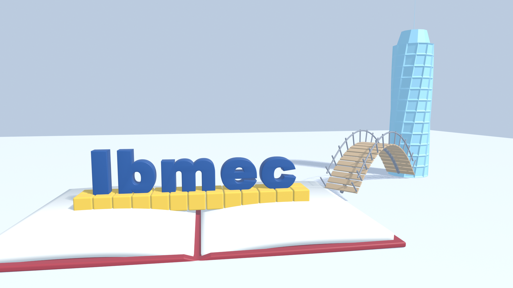
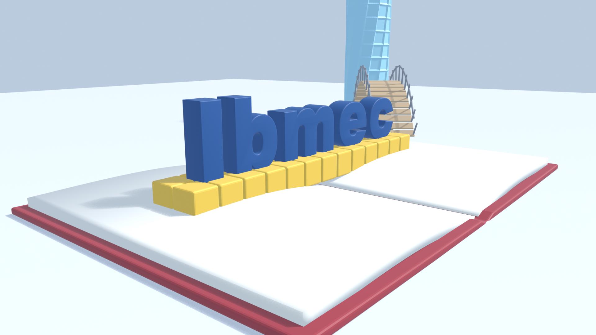
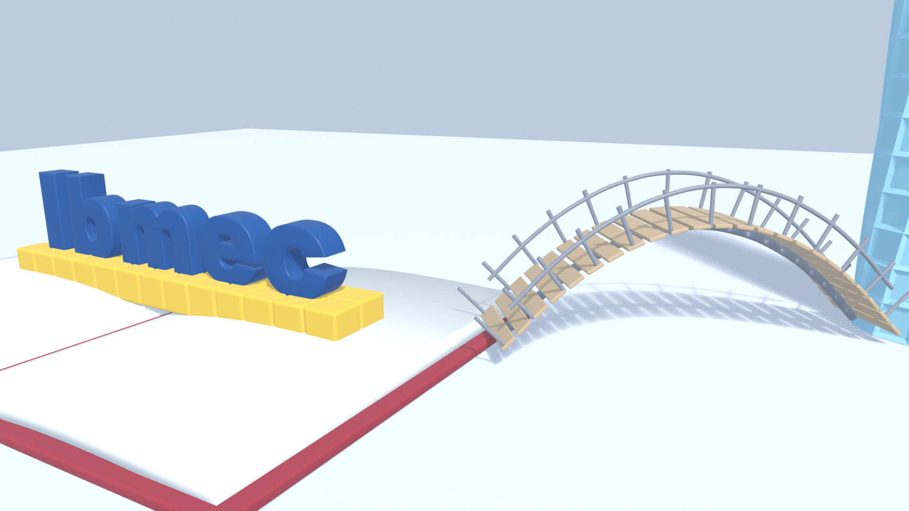
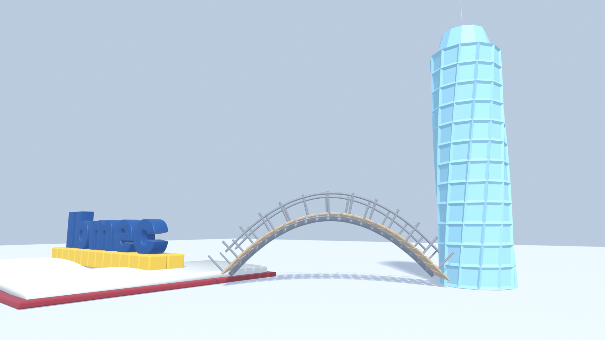
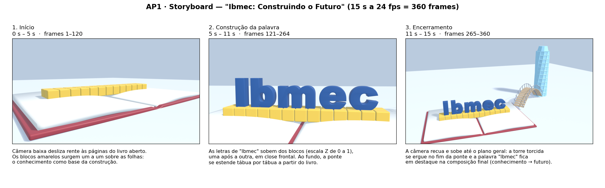

# AP1 — Conceito e Modelagem da Peça "Ibmec em 15 segundos"

**Disciplina:** Computação Gráfica — CG_26.2_8001
**Atividade:** AP1 — cena-conceito no Blender 4.5 LTS (base da animação da AP2)
**Aluno:** João Pedro Giovanelli Berla

> **Objetivo da atividade:** conceber e modelar uma cena 3D organizada, com a palavra
> **Ibmec** como elemento principal e três objetos autorais, aplicando modelagem poligonal,
> transformações geométricas, noções de espaço, composição e projeção, curvas e
> modificadores, e planejar em storyboard uma peça de 15 segundos a ser animada na AP2.

## Entregáveis

| Arquivo | O que é |
|---|---|
| [`AP1_JoaoGiovanelli.blend`](AP1_JoaoGiovanelli.blend) | Cena completa salva no Blender 4.5.14 LTS: coleção `AP1_Ibmec_Conceito`, câmera principal, timeline de 360 frames a 24 fps |
| [`imagens/01_enquadramento_principal.png`](imagens/01_enquadramento_principal.png) | Enquadramento principal (câmera `CAM_Principal`), viewport em *Material Preview* |
| [`imagens/02_livro_aberto.png`](imagens/02_livro_aberto.png), [`03_ponte_arco.png`](imagens/03_ponte_arco.png), [`04_torre_futuro.png`](imagens/04_torre_futuro.png) | Uma captura de viewport para cada objeto autoral, sempre com a palavra "Ibmec" no quadro |
| [`storyboard/storyboard.png`](storyboard/storyboard.png) | Storyboard com os três momentos da peça (início, construção da palavra, encerramento) |
| [`AP1_JoaoGiovanelli.py`](AP1_JoaoGiovanelli.py) | Script Python que constrói a cena inteira (reprodutível, aba **Scripting**) |
| [`storyboard/montar_storyboard.py`](storyboard/montar_storyboard.py) | Script (Matplotlib) que monta a prancha do storyboard a partir das capturas |
| Este `README.md` | Relatório: conceito, objetos autorais, técnicas, storyboard e plano para a AP2 |



---

## 1. Conceito — "Ibmec: Construindo o Futuro"

A peça conta, em 15 segundos, a ideia de que **o conhecimento é a base sobre a qual se
constrói o futuro**. Um **livro aberto gigante** funciona como o chão da cena. Sobre as suas
páginas, uma fileira de **blocos de construção** amarelos serve de alicerce para a palavra
**Ibmec**, que se ergue em letras azuis tridimensionais. Da borda do livro parte uma **ponte em
arco** que atravessa o espaço vazio e chega a uma **torre torcida**, de linhas futuristas.

A leitura da composição acompanha a leitura ocidental, da esquerda para a direita: primeiro o
conhecimento (livro), no centro a construção (blocos e palavra), por fim a passagem (ponte) e
o futuro (torre). Assim a cena comunica os valores pedidos: **solidez** (blocos, base
larga), **construção** (a palavra montada sobre blocos), **criatividade** (o livro que vira
cenário), **inovação e futuridade** (a torre torcida) e **empreendedorismo** (a ponte como
caminho que alguém precisa atravessar).

**Ideia de entrada, transformação e apresentação da marca:** a peça começa sem a palavra.
Primeiro aparecem só o livro e os blocos. Depois as letras de "Ibmec" **sobem dos blocos**,
uma a uma, e a ponte se estende em direção à torre. No final a câmera recua e revela a
composição completa, com a palavra legível e em destaque. A marca é apresentada como
algo **construído**, não apenas mostrado.

**Composição e projeção:** a `CAM_Principal` usa **projeção perspectiva** com lente de 26 mm
(grande-angular leve). Ela fica a 5,2 m de altura, pouco acima do topo das letras (≈ 3,1 m), e
olha levemente para baixo. Assim a palavra é vista quase de frente, sem distorção, e as
linhas do livro e da ponte convergem para o fundo, reforçando a profundidade. A palavra ocupa o terço esquerdo-central do quadro e a torre fecha o terço
direito (regra dos terços). O livro, em primeiro plano, cria profundidade.

---

## 2. A palavra "Ibmec"

| Item | Como foi feito |
|---|---|
| Criação | Objeto **Texto** (`FONT`) com "Ibmec", fonte Arial Black, tamanho 3,8 |
| Volume | **Extrusão** de 0,30 e **bevel** arredondado (profundidade 0,045, 3 segmentos) na própria curva de texto |
| Conversão | Texto → **malha** (equivale a *Object › Convert › Mesh*) |
| Separação | A malha foi separada por partes soltas (equivale a *Edit Mode › P › By Loose Parts*), gerando cinco objetos: `Ibmec_I`, `Ibmec_b`, `Ibmec_m`, `Ibmec_e`, `Ibmec_c` |
| Origem | A origem de cada letra foi levada ao **centro da base** da letra, para que na AP2 cada uma possa "crescer" a partir dos blocos (escala Z de 0 a 1) |
| Hierarquia | As cinco letras são filhas do Empty `Ibmec_Palavra`, que tem as transformações do conjunto: **rotação X = 90°** (a palavra fica em pé), **rotação Z = −4°** (leve giro para a câmera) e translação para cima da base de blocos |

A grafia e as proporções da palavra não foram alteradas. As letras não foram deformadas nem
recortadas, o que preserva a leitura e a identificação da marca.

---

## 3. Os três objetos autorais

Os três objetos foram modelados do zero, a partir de primitivas (cubo, cilindro, plano e
curva Bézier), com edição de malha e modificadores. Nenhum modelo externo foi importado.
No Outliner, cada objeto autoral é **um objeto raiz** dentro de `02_Objetos_Autorais`. As
suas partes são objetos-filhos na hierarquia.

| Objeto autoral | Função na cena | Técnicas de modelagem | Transformações |
|---|---|---|---|
| **`Livro_Aberto`** (+ filho `Livro_Paginas`) | Base de tudo: o conhecimento como chão onde a palavra é construída | Cubo escalado para 15 × 10 × 0,2. Três **loop cuts** paralelos a YZ (via *bisect*): o loop central foi **abaixado** para formar a dobra da lombada. **Extrusão** da face inferior da lombada. Modificador **Bevel** nas bordas da capa. Páginas: plano com perfil curvo (sobe rápido junto à lombada e desce até a borda), **Mirror** em X para o outro lado e **Solidify** para dar a espessura do bloco de folhas | Rotação Z = −4° (quebra a frontalidade); páginas herdam a transformação da capa (parent) |
| **`Ponte_Arco`** (+ filhos `Ponte_Tabuleiro`, `Ponte_Guarda`, `Ponte_Postes`) | Passagem: liga o livro (conhecimento) à torre (futuro); na AP2 a ponte "se constrói" tábua por tábua | Viga do arco: **curva Bézier** de 9 pontos (perfil parabólico, 2,2 m de flecha) com **bevel** da curva. Tabuleiro: **uma** tábua com **Array** em modo *Fit Curve* + **Bevel** + **Curve** (as tábuas seguem o arco). Guarda-corpo: duas **curvas** paralelas com bevel. Postes: um cilindro com **Array** (offset constante) + **Mirror** em Y + **Curve** | Translação para a borda do livro, **rotação Z = 35°** (direção da torre); os filhos usam o espaço local da curva |
| **`Torre_Futuro`** | Futuro, inovação: o ponto de chegada da ponte e o elemento vertical que equilibra a composição | Cilindro de 12 lados com 11 **loop cuts** horizontais (andares). **Inset individual com profundidade** em todas as faces laterais (janelas afundadas). No topo: **inset + extrusão** (coroa, estreitada com escala) e mais um **inset + extrusão** longa (antena). Modificadores **Simple Deform › Twist** de 75° (torção) e **Bevel** nas quinas | Posicionada no fim da ponte (calculado a partir do ângulo e do comprimento da ponte), **rotação Z = 15°**, **escala Z = 1,1** |

### Por que estes três objetos

- **Livro:** é o símbolo mais direto de educação. Colocá-lo como *chão* da cena (e não
  como objeto sobre a mesa) transforma a metáfora em espaço: tudo o que se constrói na peça
  literalmente se apoia no conhecimento.
- **Ponte:** representa passagem e empreendedorismo, o esforço de sair de onde se está
  (a formação) e chegar a um objetivo. Ela também resolve a composição: liga os dois
  polos do quadro e cria uma diagonal que conduz o olhar da palavra até a torre. O arco
  foi escolhido por ser, ao mesmo tempo, estrutura sólida e curva elegante.
- **Torre torcida:** é o "futuro" da narrativa. A verticalidade equilibra a horizontalidade
  do livro e da palavra, e a torção sugere movimento e inovação, algo que ainda está se
  transformando. É também o objeto com mais técnica de modelagem (janelas por inset,
  coroa por extrusão, Twist), mostrando evolução em relação às primitivas.

Juntos, os três objetos formam uma frase visual (**conhecimento → caminho → futuro**) com a
palavra **Ibmec** no centro, como o agente que realiza essa passagem.

### Imagens de cada objeto (com a palavra)

| Livro_Aberto | Ponte_Arco | Torre_Futuro |
|---|---|---|
|  |  |  |

---

## 4. Técnicas de modelagem e conceitos geométricos

**Recursos de modelagem usados** (o enunciado pede pelo menos dois além da escala de
primitivas):
- **Edição de malha:** extrusão (lombada, coroa e antena da torre), inset (janelas e topo da
  torre), loop cuts (lombada do livro e andares da torre) e bevel (bordas).
- **Curvas:** curva Bézier da ponte, curvas do guarda-corpo e curva de texto com
  extrusão e bevel.
- **Modificadores**, deixados **sem aplicar** de propósito, para que as técnicas continuem
  visíveis e editáveis no painel de modificadores: Array (incluindo *Fit Curve*), Curve,
  Mirror, Solidify, Simple Deform e Bevel.
- **Composição de malhas e hierarquia:** a palavra em cinco letras sob um Empty, o livro
  com capa e páginas, a ponte com viga, tabuleiro, guarda-corpo e postes.

**Transformações geométricas intencionais:**
- **Translação:** cada elemento foi posicionado em relação aos outros. A ponte começa na
  borda do livro. A posição da torre é **calculada** girando o vetor (comprimento da ponte,
  0, 0) em 35° no eixo Z e somando o ponto inicial da ponte, uma composição de rotação e
  translação.
- **Rotação:**
  - palavra: 90° em X, para ficar em pé;
  - palavra e blocos: −4° em Z, para acompanhar a câmera;
  - ponte: 35° em Z;
  - torre: 15° em Z, para que as janelas não fiquem alinhadas à câmera;
  - câmera: orientada por restrição *Track To* para o Empty `Alvo_Camera`.
- **Escala:** a torre tem escala não uniforme (1,1 em Z). A capa do livro, os blocos e as
  tábuas partem de cubos escalados. A coroa e a antena da torre foram escaladas **em torno
  de um pivô** (o topo da torre), não da origem.

**Espaço local × global:** as letras, as páginas e as partes da ponte são filhas de outro
objeto. A posição delas é definida no **espaço local do pai**. Por exemplo, basta girar
`Ibmec_Palavra` para girar as cinco letras juntas. O modificador *Curve* deforma o tabuleiro
no espaço da curva `Ponte_Arco`.

---

## 5. Organização da cena (Outliner)

```
AP1_Ibmec_Conceito
├─ 01_Palavra            Ibmec_Palavra (Empty) → Ibmec_I, Ibmec_b, Ibmec_m, Ibmec_e, Ibmec_c
├─ 02_Objetos_Autorais   Livro_Aberto → Livro_Paginas
│                        Ponte_Arco → Ponte_Tabuleiro, Ponte_Guarda, Ponte_Postes
│                        Torre_Futuro
├─ 03_Auxiliares         Blocos_Construcao (Array X × Array Y + Bevel), Chao
├─ 04_Camera_Luz         CAM_Principal (Track To → Alvo_Camera), Alvo_Camera, Luz_Sol
└─ 05_Storyboard         CAM_SB_01_Inicio, CAM_SB_02_Construcao, CAM_SB_03_Final
```

- Todos os objetos da cena estão dentro de `AP1_Ibmec_Conceito`: nada ficou solto na
  *Scene Collection*.
- Cada malha tem o nome `<objeto>_mesh` e cada material o nome `mat_<objeto>`.
- **Timeline:** frames 1 a 360 a **24 fps**, o que dá **15 segundos**. A cena é salva no
  frame 1, com `CAM_Principal` como câmera ativa, em 1920 × 1080.
- As três câmeras `CAM_SB_*` guardam o enquadramento de cada momento do storyboard. Na AP2
  elas servem de referência para os keyframes da câmera principal.
- As cores dos materiais são simples, só para a leitura no *Solid* e no *Material Preview*.
  Materiais, texturas e iluminação ficam para a AP2.

---

## 6. Storyboard (15 s = 360 frames)



| # | Tempo | Frames | O que acontece | Câmera |
|---|---|---|---|---|
| 1 — Início | 0–5 s | 1–120 | O livro aberto em cena; os blocos amarelos surgem um a um sobre as páginas. A palavra, a ponte e a torre ainda não existem | `CAM_SB_01_Inicio`: baixa, rente às páginas, deslizando lateralmente |
| 2 — Construção da palavra | 5–11 s | 121–264 | As letras de "Ibmec" sobem dos blocos (escala Z 0 → 1, com pequeno *overshoot*), da esquerda para a direita; ao fundo a ponte se estende tábua por tábua | `CAM_SB_02_Construcao`: close frontal na palavra |
| 3 — Encerramento | 11–15 s | 265–360 | A torre se ergue no fim da ponte e torce (Twist animado); a câmera recua e sobe até o plano geral, e a palavra fica em destaque. Últimos ~1,5 s parados na composição final | `CAM_SB_03_Final` → `CAM_Principal` |

---

## 7. Plano para a AP2

- **Animação por keyframes e interpolação:**
  - blocos: surgimento (escala e translação em Z);
  - letras: escala Z de 0 a 1 em sequência, com interpolação *Back/Elastic* para um
    pequeno "salto";
  - tabuleiro da ponte: o `count` do Array ou a *Bevel Factor* da curva animada, para a
    ponte crescer ao longo do arco;
  - torre: escala Z e ângulo do *Simple Deform* animados.
- **Câmera:** keyframes na `CAM_Principal` e no `Alvo_Camera`, passando pelos três
  enquadramentos do storyboard. Easing *Bezier* para movimentos suaves.
- **Iluminação:** substituir a luz única por um esquema de três pontos (*key*, *fill* e
  *rim*) e um HDRI suave no World.
- **Materiais e texturas:**
  - azul institucional nas letras, com leve brilho;
  - capa do livro em tecido ou couro e textura de papel nas páginas;
  - madeira no tabuleiro e metal na viga e no guarda-corpo;
  - vidro com emissão nas janelas da torre.
- **Acabamento e render:** EEVEE (mais rápido) ou Cycles para o quadro final, profundidade
  de campo leve na câmera, exportação do vídeo em 1920 × 1080, 24 fps, H.264 (MP4).
- **Ajustes de modelagem previstos:** detalhes extras na torre (faixas de LED entre
  andares) e nas páginas (algumas folhas soltas), sem alterar a ideia central nem a
  organização da cena.

---

## 8. Checklist dos requisitos da AP1

| Requisito | Onde está |
|---|---|
| 1. Blender 4.5 LTS | Arquivo salvo no Blender **4.5.14 LTS** |
| 2. Coleção `AP1_Ibmec_Conceito` organizando palavra, objetos e auxiliares | Seção 5: cinco subcoleções numeradas, nada fora da coleção principal |
| 3. "Ibmec" em destaque e legível no enquadramento principal | `imagens/01_enquadramento_principal.png` |
| 4. Três objetos autorais com nomes coerentes | `Livro_Aberto`, `Ponte_Arco`, `Torre_Futuro` (seção 3) |
| 5. Translação, rotação e escala intencionais | Seção 4 (transformações) e colunas da tabela da seção 3 |
| 6. Pelo menos dois recursos de modelagem além da escala | Extrusão, inset, loop cut, bevel, curvas, Array, Curve, Mirror, Solidify, Simple Deform (seção 4) |
| 7. Câmera principal enquadrando a composição | `CAM_Principal` com *Track To* para `Alvo_Camera` |
| 8. 15 s a 24 fps (360 frames) | *Frame Start* 1, *End* 360, 24 fps |
| 9. Storyboard com pelo menos três momentos | `storyboard/storyboard.png` (seção 6) |

---

## 9. Como reproduzir

1. Abrir [`AP1_JoaoGiovanelli.blend`](AP1_JoaoGiovanelli.blend) no Blender 4.5 LTS. A cena
   já está pronta.
2. Para reconstruir do zero: arquivo novo → aba **Scripting** → *Open*
   [`AP1_JoaoGiovanelli.py`](AP1_JoaoGiovanelli.py) → **Run Script** (Alt+P). O script apaga
   o que ele próprio criou antes e monta a coleção novamente.
3. Capturas: *Viewport Shading* em **Material Preview**, vista da câmera (Numpad 0) e
   *View › Viewport Render Image*. As capturas do storyboard usam as câmeras `CAM_SB_*`.
   No momento 1 a palavra, a ponte e a torre ficam ocultas.
4. Prancha do storyboard: `python storyboard/montar_storyboard.py` (requer `matplotlib`).

---

## 10. Referências

- Blender Foundation. *Blender 4.5 LTS Manual*: Modeling › Meshes (Extrude, Inset, Loop
  Cut, Bevel); Modeling › Curves; Modeling › Texts; Modifiers (Array, Curve, Mirror,
  Solidify, Simple Deform, Bevel); Cameras. <https://docs.blender.org/manual/en/4.5/>
- Blender Foundation. *Blender Python API 4.5*: `bmesh.ops`, `bpy.types.Modifier`,
  `bpy.types.TextCurve`. <https://docs.blender.org/api/4.5/>
- Enunciado da AP1 e slides da disciplina (CG_26.2_8001).
  <https://jonh-carvalho.github.io/CG_26.2_8001/Avalia/ap1/>
- HUGHES, J. F. et al. *Computer Graphics: Principles and Practice*. 3. ed. Addison-Wesley,
  2014. Caps. 10–11 (transformações).

---

*Conceito, modelagem e scripts originais. A palavra "Ibmec" foi usada apenas como elemento
da peça acadêmica, sem alteração da grafia.*
